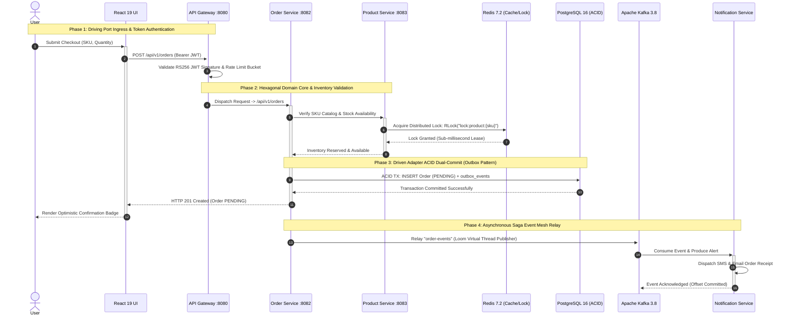
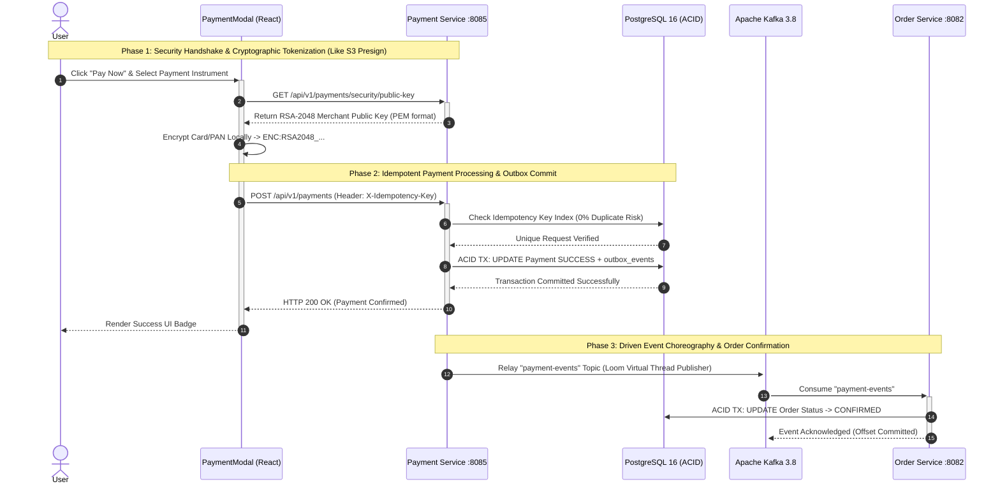
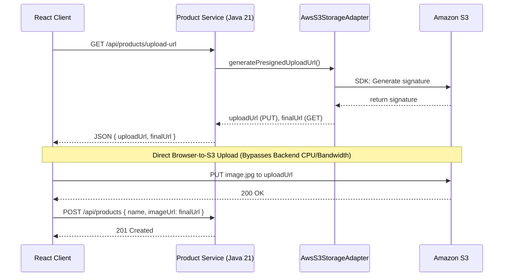

# Java 21 · Spring Boot 3.3 · Microservices Full-Stack Project

A production-ready microservices project with a React frontend and a Java 21 / Spring Boot 3.3 backend, using Spring Cloud, Apache Kafka (KRaft mode), Redis, and PostgreSQL.

---

## 🛠️ Tech Stack

### Frontend
| Category | Technology |
|----------|------------|
| **Core** | React 18 + Vite 5 |
| **Routing** | React Router v6 |
| **State** | TanStack Query v5 |
| **Forms** | React Hook Form |
| **HTTP** | Axios + JWT Interceptors |

### Backend & Infrastructure
| Category | Technology |
|----------|------------|
| **Backend** | Java 21 + Spring Boot 3 |
| **Gateway** | Spring Cloud Gateway |
| **Messaging** | Apache Kafka |
| **Database** | PostgreSQL 16 |
| **Cache** | Redis 7 |
| **Containers** | Docker (multi-stage builds) |
| **Orchestration** | Kubernetes |
| **K8s Packaging** | Helm (Bitnami charts) |

### Microservices & Ports
| Service | Port | Description |
|---------|------|-------------|
| **API Gateway** | `8080` | Entry point; JWT auth (RS256), CORS, rate limiting, circuit breakers |
| **User Service** | `8081` | Authentication, registration, JWT issuance, RBAC claims |
| **Order Service** | `8082` | Order lifecycle, Saga/Outbox pattern, aggregator endpoints |
| **Product Service** | `8083` | Product catalog, caching, Redisson locks for inventory |
| **Notification Service** | `8084` | Kafka event consumer; sends SMS/email, streams via SSE |
| **Payment Service** | `8085` | PCI-DSS RSA-2048 tokenization, idempotency keys, 6 payment methods |

### Database-per-Service (16 Tables Total)

Each stateful microservice owns its own database schema. This keeps services loosely coupled, independently scalable, and free of shared-database dependencies.

| Service | Table Name | Java Entity | Purpose |
| :--- | :--- | :--- | :--- |
| **User Service** | `users` | `User.java` | User profiles, credentials, roles for RBAC |
| | `refresh_tokens` | `RefreshToken.java` | JWT refresh tokens for session management |
| | `outbox_events` | `OutboxEvent.java` | Reliably emits domain events (e.g. `UserCreatedEvent`) |
| | `audit_logs` | `AuditLog.java` | Security and admin action audit trail |
| | `log_rest` | `LogRest.java` | Logs HTTP request/response payloads |
| **Product Service** | `products` | `Product.java` | Catalog items, SKUs, pricing, stock |
| | `outbox_events` | `OutboxEvent.java` | Emits inventory/product change events |
| | `audit_logs` | `AuditLog.java` | Audit history for catalog updates |
| | `log_rest` | `LogRest.java` | API traffic logging |
| **Order Service** | `orders` | `Order.java` | Order transactions and status |
| | `outbox_events` | `OutboxEvent.java` | Publishes order lifecycle events |
| | `audit_logs` | `AuditLog.java` | Order processing audit trail |
| | `log_rest` | `LogRest.java` | API request/response logging |
| **Payment Service** | `payments` | `Payment.java` | Payment transactions and status |
| | `payment_outbox` | `PaymentOutboxEvent.java` | Dedicated outbox for payment events |
| | `payment_audit_log` | `PaymentAuditLog.java` | Audit trail for PCI-DSS payment operations |
| **Notification Service** | *None (stateless)* | *N/A* | Stateless Kafka consumer; sends email/SMS |
| **API Gateway** | *None (stateless)* | *N/A* | Stateless routing layer |

**Why do `outbox_events`, `audit_logs`, and `log_rest` repeat across services?**
- **Outbox Pattern** (`outbox_events`, `payment_outbox`): events are written in the same transaction as the main entity, then relayed to Kafka by a background publisher — this avoids distributed race conditions.
- **Shared audit/logging tables** (`audit_logs`, `log_rest`): defined once in `common-module` and mapped into each service's schema for consistent compliance and request tracing.

---

## ✨ Recent Enhancements

- **End-to-End Refund Processing:** Complete lifecycle support for processing refunds. Customers can request refunds on cancelled orders, transitioning them to `REFUND_REQUESTED`.
- **Admin Refund Workflow:** Dedicated Admin UI and backend endpoints to approve or reject refunds. Rejected refunds dynamically store and display the rejection reason.
- **Interactive Refund Stepper:** The frontend features a beautiful, dynamic timeline stepper allowing customers to track their refund from initiation, through approval/rejection, and final processing.
- **RBAC UI Security:** The `Aggregator` route and menu items are strictly protected behind an `<AdminRoute>`, ensuring only `ADMIN` roles can view cross-service data aggregations.
- **Improved Build Scripts:** `start-down.ps1` and developer scripts have been optimized to fully enforce the Maven `compile` phase before `spring-boot:run`, completely eliminating MapStruct generated-source caching issues across modules.

---

## 🏗️ Architecture & Sequence Diagrams

### System Design Blueprint


> [!TIP]
> **Zoom & pan the diagrams**:
> - On GitHub.com, click any diagram to open the native fullscreen viewer (pan/zoom with mouse).
> - Or open **[docs/java21-microservices-guide.html](file:///d:/Projects/microservices1/Java_21_ReactJs_FullStack/docs/java21-microservices-guide.html)** for zoom controls and drag-panning on both the blueprint and Mermaid diagrams.

### 1. Order Creation & Saga Flow


### 2. Payment Tokenization Flow (PCI-DSS, RSA-2048)


---

## 📚 Full Documentation Guide

For interactive docs with zoom controls, search, and an interview prep cheat sheet, see **[docs/java21-microservices-guide.html](file:///d:/Projects/microservices1/Java_21_ReactJs_FullStack/docs/java21-microservices-guide.html)** or **[docs/FULLSTACK_MICROSERVICES_INTERVIEW_ARCHITECTURE_GUIDE.md](file:///d:/Projects/microservices1/Java_21_ReactJs_FullStack/docs/FULLSTACK_MICROSERVICES_INTERVIEW_ARCHITECTURE_GUIDE.md)**. It covers: system architecture, visual blueprints, project structure, prerequisites, Java 21/Virtual Threads, Spring Boot config, Docker infra, Kafka, Redis, API Gateway, each microservice, payment security, UI integration/testing, Kubernetes, AWS provisioning, CI/CD, an interview cheat sheet, and RBAC test scenarios.

The React frontend's login screen also includes a **Dynamic Architecture Dashboard** — an animated, native CSS/HTML visualization of the whole system topology.

---

## 🌟 Why This Stack

- **Java 21 & Spring Boot 3.3**: Virtual Threads for high concurrency with low overhead; Records and pattern matching cut boilerplate.
- **React 18 & Vite 5**: Fast Hot Module Replacement and optimized builds; React 18 concurrent rendering improves perceived speed.
- **Apache Kafka (KRaft)**: Event backbone that decouples services and delivers messages reliably, without Zookeeper.
- **PostgreSQL 16**: ACID-compliant storage with JSONB support.
- **Redis 7**: Fast caching and session management, reducing DB load.
- **Spring Cloud Gateway**: Single entry point for routing, security, rate limiting, and CORS.

---

## 🛡️ Best Practices Applied

**Scalability**
- All services are stateless — session/state lives in Redis/PostgreSQL — enabling horizontal autoscaling.
- Heavy or non-blocking work (e.g. notifications) is offloaded to Kafka.
- Virtual Threads let each service handle very high concurrent load without exhausting thread pools.

**Reliability**
- Circuit breakers and retries prevent cascading failures between services.
- Spring Boot Actuator health/metrics endpoints let Kubernetes auto-restart unhealthy pods.
- Kafka consumers are idempotent to safely handle at-least-once delivery.

**Maintainability**
- Clean layering (Controller/Service/Repository); DTOs use Java Records to isolate the domain model.
- Flyway manages versioned schema migrations.
- Configuration is externalized via env vars/config maps (12-Factor App style).

---

## 🔒 Security

Security follows a **Zero-Trust** model at the network boundary.

1. **API Gateway as a shield** — a global filter validates every JWT before a request reaches any backend service; Redis-backed rate limiting blocks abuse/DDoS; an optional OAuth2/Keycloak profile is supported; validated user ID and roles are passed downstream as trusted headers (`X-User-Id`).
2. **Stateless JWT auth** — `user-service` issues signed JWTs, enabling infinite horizontal scaling with no session replication.
3. **Password hashing** — passwords are salted and hashed with BCrypt (work factor 12), never stored in plaintext.
4. **Network isolation** — only the API Gateway is publicly exposed; services, databases, caches, and Kafka stay on private networks.
5. **CORS** — restricted at the gateway to trusted origins only.

**Public endpoints (no JWT required):**
```
POST /api/auth/register   ← Register a new user
POST /api/auth/login      ← Login and get JWT
GET  /actuator/health     ← Health check
```

---

## 💡 Codebase Guidelines

1. **Favor immutability** — use Records for DTOs/events; prefer constructors/builders over setters.
2. **Keep bounded contexts strict** — services never share a database; cross-service data comes via API calls or Kafka events.
3. **Test thoroughly** — use Testcontainers for integration tests against real Postgres/Kafka.
4. **Version your APIs** — e.g. `/api/v1/orders` → `/api/v2/orders` for breaking changes.
5. **Observability first** — use distributed tracing (Jaeger/Zipkin) and centralized logging (ELK/Loki).
6. **Keep dependencies current** — update Maven/npm packages regularly for security and performance.

---

## 🧩 Design Patterns Used

| Pattern / Concept | How it's applied |
|---|---|
| **API Gateway** | Single entry point handling routing, JWT validation, CORS |
| **Saga + Outbox** | `order-service` and `product-service` write events to an outbox table in the same transaction, avoiding dual-write issues |
| **Fault Tolerance** | Circuit breaker, retry, and fallback via Resilience4j |
| **Bulkhead** | Limits concurrent requests/threads to isolate failures |
| **Pub-Sub** | Kafka drives async, event-based flows (e.g. notifications) |
| **Distributed Locking** | Redisson `RLock` safely handles concurrent inventory changes |
| **Scalability** | Virtual Threads, Redis caching, Kubernetes HPA |
| **Zero Data Loss** | Redis-based idempotency plus DLQ-style retries on Kafka |
| **Availability** | Kubernetes ReplicaSets, gateway fallbacks, stateless design |
| **Readability/Maintainability** | Records, MapStruct, decoupled bounded contexts, Flyway |
| **Load Balancing / Routing** | Kubernetes Services + Spring Cloud Gateway path predicates |
| **Service Discovery** | Native Kubernetes DNS |
| **SOLID** | Applied throughout (e.g. single-responsibility services, DI via Spring IoC) |
| **Caching** | Redis offloads reads and powers rate limiting |
| **Connection Pooling** | HikariCP tuned (`maximum-pool-size=50`) for Virtual Thread workloads |
| **i18n** | Global exception handlers localize error messages via `Accept-Language` |
| **DRY** | Shared `ApiResponse<T>` wrapper across all services |
| **Reactive** | Gateway (WebFlux) uses `Mono`/`Flux`; backend services use Virtual Threads |

**Code-level (GoF) patterns:** Dependency Injection (Spring IoC), Proxy (AOP audit logging, `@Transactional`), DTO (Java Records), Factory/Mapper (MapStruct), Facade (`@Service` classes), Singleton (Spring beans).

---

## 🏷️ Annotation Reference

A quick reference to the 60+ Spring/JPA/Kafka/Security/Lombok annotations used across all modules.

**Dependency Injection & Stereotypes**
`@SpringBootApplication`, `@Component`, `@Service`, `@Repository`, `@RestController`, `@Configuration`, `@Bean`, `@Primary`, `@Qualifier`, `@Autowired`, `@Value`, `@ConfigurationProperties`, `@ConfigurationPropertiesScan`, `@Order`

**Web / REST**
`@RequestMapping`, `@GetMapping`/`@PostMapping`/`@PutMapping`/`@DeleteMapping`/`@PatchMapping`, `@RequestParam`, `@PathVariable`, `@RequestBody`, `@RequestHeader`, `@ResponseStatus`, `@CrossOrigin`

**JPA / Hibernate**
`@Entity`, `@Table`, `@Id`, `@GeneratedValue`, `@Column`, `@Enumerated`, `@CreationTimestamp`/`@UpdateTimestamp`, `@Version` (optimistic locking), `@OneToMany`/`@ManyToOne`, `@JoinColumn`

**Transactions, Caching & Resilience**
`@Transactional`, `@EnableCaching`, `@Cacheable`, `@CachePut`, `@CacheEvict`, `@CircuitBreaker`, `@Retry`, `@TimeLimiter`

**Kafka**
`@KafkaListener`, `@Payload`, `@Header`, `@SendTo`, `@EventListener`/`@TransactionalEventListener`

**Security**
`@EnableWebSecurity`, `@EnableMethodSecurity`, `@PreAuthorize`, `@Secured`/`@RolesAllowed`, `@AuthenticationPrincipal`

**Lombok**
`@Getter`/`@Setter`, `@NoArgsConstructor`/`@AllArgsConstructor`/`@RequiredArgsConstructor`, `@Builder`/`@Builder.Default`, `@Slf4j`, `@EqualsAndHashCode`, `@Data`

**Validation (Jakarta)**
`@Valid`, `@Validated`, `@NotNull`/`@NotBlank`/`@NotEmpty`, `@Min`/`@Max`/`@Positive`/`@PositiveOrZero`, `@Email`/`@Pattern`/`@Size`

**AOP & Tracing**
`@Aspect`, `@Around`/`@Before`/`@AfterThrowing`, `@WithSpan`, `@SpanAttribute`

**Testing**
`@SpringBootTest`, `@WebMvcTest`, `@DataJpaTest`, `@MockBean`, `@Test`/`@BeforeEach`/`@AfterEach`/`@DisplayName`

---

## 📦 Project Structure

```
microservices-demo/
├── pom.xml                       ← Parent POM (Java 21, Spring Boot 3.3.2)
├── docker-compose.yml            ← Full stack (infra + services)
├── docker-compose-infra.yml      ← Infra only (for local IDE dev)
├── README.md
│
├── api-gateway/                  ← Spring Cloud Gateway (:8080)
├── user-service/                 ← Auth, JWT, User profiles (:8081)
├── order-service/                ← Orders, Kafka producer (:8082)
├── product-service/              ← Product catalog, inventory (:8083)
├── notification-service/         ← Kafka consumer, notifications (:8084)
├── payment-service/              ← Payments, Outbox, RSA-2048 cryptograms (:8085)
│
└── k8s/                          ← Kubernetes manifests
    ├── namespace.yml
    ├── configmap.yml
    ├── secrets.yml
    ├── api-gateway.yml
    └── microservices.yml
```

---

## 🔧 Prerequisites

| Tool | Version | Purpose |
|------|---------|---------|
| Java JDK | 21 LTS | Runtime |
| Maven | 3.9+ | Build |
| Docker Desktop | 26+ | Containers |
| kubectl | 1.30+ | K8s CLI (prod) |

---

## 🚀 Quick Start — Local Development

### Option 1: IDE + Infra Docker (recommended)

```bash
# 1. Clone the repository
git clone <repo-url>
cd microservices-demo

# 2. Start infrastructure only (PostgreSQL, Redis, Kafka KRaft, Kafka UI — no Zookeeper)
docker compose -f docker-compose-infra.yml up -d

# 3. Build all modules
mvn clean package -DskipTests
```

**Start backend services — Windows (PowerShell scripts provided):**
```powershell
.\start-all.ps1    # Starts all services and waits for health checks
.\stop-all.ps1     # Stops all microservices
.\restart-all.ps1  # Stops and restarts all services
.\start-down.ps1   # Starts only services that are currently down
```

**Start backend services — manual (any OS), one terminal per service:**
```bash
cd user-service && mvn spring-boot:run
cd order-service && mvn spring-boot:run
cd product-service && mvn spring-boot:run
cd notification-service && mvn spring-boot:run
cd payment-service && mvn spring-boot:run
cd api-gateway && mvn spring-boot:run
```

**Start the frontend:**
```bash
cd ../frontend
npm install
npm run dev
```
Access the app at `http://localhost:3000`.

### Option 2: Full Docker Compose

```bash
mvn clean package -DskipTests
docker compose up --build -d

docker compose logs -f api-gateway
docker compose logs -f user-service
```

---

## 🗃️ Database Configuration

All services connect to a single PostgreSQL instance:

| Parameter | Value |
|-----------|-------|
| Host | `localhost:5432` |
| Database | `engine` |
| Username | `postgres` |
| Password | `postgres` |

Flyway handles schema migrations automatically on startup.

---

## 📋 API Reference

### Authentication
```bash
# Register
curl -X POST http://localhost:8080/api/auth/register \
  -H "Content-Type: application/json" \
  -d '{"fullName":"John Doe","email":"john@example.com","password":"Secret123!"}'

# Login
curl -X POST http://localhost:8080/api/auth/login \
  -H "Content-Type: application/json" \
  -d '{"email":"john@example.com","password":"Secret123!"}'
# Response: {"success":true,"data":{"accessToken":"eyJ...","tokenType":"Bearer",...}}
```

### Orders (requires JWT)
```bash
TOKEN="eyJ..." # from login response

# Create order
curl -X POST http://localhost:8080/api/orders \
  -H "Authorization: Bearer $TOKEN" \
  -H "Content-Type: application/json" \
  -d '{
    "userId": "uuid-of-user",
    "productId": "uuid-of-product",
    "quantity": 2,
    "totalPrice": 59.98
  }'

# Get order
curl http://localhost:8080/api/orders/{id} \
  -H "Authorization: Bearer $TOKEN"

# Get user's orders
curl http://localhost:8080/api/orders/user/{userId} \
  -H "Authorization: Bearer $TOKEN"
```

### Products
```bash
# Get all products (paginated)
curl "http://localhost:8080/api/products?page=0&size=10"

# Get by category
curl http://localhost:8080/api/products/category/Electronics

# Decrement stock (after order)
curl -X PUT "http://localhost:8080/api/products/{id}/stock/decrement?qty=1" \
  -H "Authorization: Bearer $TOKEN"
```

### Payments & Security (requires JWT)
```bash
# Get merchant RSA-2048 public key (for client-side card tokenization)
curl http://localhost:8080/api/v1/payments/security/public-key \
  -H "Authorization: Bearer $TOKEN"

# Process payment (Credit Card / UPI / NetBanking / Wallet / BNPL / EMI)
curl -X POST http://localhost:8080/api/v1/payments \
  -H "Authorization: Bearer $TOKEN" \
  -H "Content-Type: application/json" \
  -d '{
    "orderId": 100,
    "userId": 1,
    "amount": 99.99,
    "currency": "USD",
    "paymentMethod": "CREDIT_CARD",
    "idempotencyKey": "IDEM-CC-001",
    "cardLast4": "4242",
    "cardBrand": "VISA",
    "gatewayProvider": "STRIPE_SIMULATOR"
  }'

# Refund payment
curl -X POST http://localhost:8080/api/v1/payments/{id}/refund \
  -H "Authorization: Bearer $TOKEN" \
  -H "Content-Type: application/json" \
  -d '{"reason":"Customer cancellation","amount":99.99}'
```

---

## ☕ Java 21 Features Used

| Feature | Where |
|---------|----------|
| **Records** | All DTOs (`OrderRequest`, `UserResponse`, `JwtResponse`, `PaymentRequest`, etc.) |
| **Pattern matching switch** | `OrderResponse.from()`, `OrderService.validateTransition()`, `PaymentInstrument` sealed hierarchy, and more |
| **Text blocks** | Email templates, error JSON bodies, PEM key formatting |
| **Virtual threads** | Enabled (`spring.threads.virtual.enabled=true`) in all services |
| **Sealed types & interfaces** | `OrderStatus` state machine, `PaymentInstrument` (Card, UPI, NetBanking, Wallet, BNPL, EMI, Mandate) |
| **Guarded patterns** | Stock-level switch in `ProductResponse.from()` |

---

## 🐳 Docker

Each service uses a multi-stage Dockerfile:
1. **Builder stage**: `eclipse-temurin:21-jdk-alpine` + Maven build
2. **Runtime stage**: `eclipse-temurin:21-jre-alpine`, non-root user

**Kafka** runs in KRaft mode (`apache/kafka:3.8.0`) — no Zookeeper needed.
**JVM flags**: `-XX:+UseZGC -XX:+ZGenerational` (low-latency GC for Java 21)

---

## ☸️ Kubernetes Deployment

```bash
# Create namespace
kubectl apply -f k8s/namespace.yml

# Create ConfigMap and Secrets
# Note: edit k8s/secrets.yml to add your base64-encoded MAIL_PASS before applying
kubectl apply -f k8s/configmap.yml
kubectl apply -f k8s/secrets.yml

# Deploy infrastructure (PostgreSQL, Redis, Kafka via Helm)
helm repo add bitnami https://charts.bitnami.com/bitnami
helm install postgres bitnami/postgresql -n microservices \
  --set auth.username=postgres \
  --set auth.password=postgres \
  --set auth.database=engine

helm install redis bitnami/redis -n microservices \
  --set auth.enabled=false

helm install kafka bitnami/kafka -n microservices \
  --set kraft.enabled=true \
  --set zookeeper.enabled=false

# Deploy services
kubectl apply -f k8s/api-gateway.yml
kubectl apply -f k8s/microservices.yml

# Check status
kubectl get pods -n microservices
kubectl get services -n microservices
```

---

## ☁️ AWS Production Architecture Mapping

For a production deployment, offload stateful services to managed AWS offerings:

| Local / K8s Component | Managed AWS Service | Benefit |
|------------------------|---------------------|----------|
| **Kubernetes** | **Amazon EKS** | Managed control plane; run services on Fargate or managed EC2 node groups |
| **PostgreSQL** | **Amazon RDS for PostgreSQL** | Automated backups, Multi-AZ HA, easier scaling |
| **Redis** | **Amazon ElastiCache** | Managed, sub-millisecond latency for rate limiting/caching |
| **Apache Kafka** | **Amazon MSK** | Managed Kafka without running KRaft/Zookeeper yourself |
| **K8s Secrets** | **AWS Secrets Manager** | Mount secrets dynamically into EKS pods (via ASCP) instead of static YAML |
| **Docker Registry** | **Amazon ECR** | Stores the multi-stage Docker images |
| **Gateway LoadBalancer** | **AWS ALB** | Maps the K8s LoadBalancer service to an ALB for WAF/SSL |

**Deployment steps:**
1. Provision VPC, RDS, ElastiCache, and MSK (Terraform or AWS CDK).
2. Point `k8s/configmap.yml` (`DB_URL`, `REDIS_HOST`, `KAFKA_BROKERS`) at the AWS endpoints.
3. Apply the stateless microservice manifests (`k8s/api-gateway.yml`, `k8s/microservices.yml`) to EKS.

### S3 Direct Upload (Hexagonal Architecture)
`product-service` uses Ports & Adapters to support AWS S3 presigned URL uploads, so local developers don't need AWS credentials.



### Distributed Locking (Redisson + AOP)
To prevent race conditions (e.g. two users buying the last item at once), `product-service` uses Redis distributed locks via Redisson, wrapped in a custom `@DistributedLock` annotation and Spring AOP aspect:

```java
@Transactional
@DistributedLock(keyPrefix = "lock:inventory:")
public void deductStock(Long id, int quantity) {
    // Perfectly synchronized across all service instances!
    // ...
}
```

---

## 🔗 Quick Access URLs

**Observability**
- Grafana: [http://localhost:3001](http://localhost:3001) *(login: `admin` / `admin`)*
- Prometheus: [http://localhost:9090](http://localhost:9090)
- Jaeger UI: [http://localhost:16686](http://localhost:16686)
- Kafka UI: [http://localhost:9093](http://localhost:9093)

**Application**
- React Frontend: [http://localhost:3000](http://localhost:3000)
- API Gateway: [http://localhost:8080](http://localhost:8080)

**Direct microservice ports (bypassing gateway)**
- User: `8081` · Order: `8082` · Product: `8083` · Notification: `8084`

---

## 🧪 Testing

```bash
# Unit tests
mvn test

# Integration tests (requires Docker)
mvn verify

# Single service tests
cd user-service && mvn test
```

---

## 📊 Observability & Monitoring

- **Distributed Tracing**: Micrometer + OpenTelemetry tag every log with a `traceId`, following a request across services and Kafka events.
- **Metrics & Health**: Spring Boot Actuator exposes `/actuator/health` and `/actuator/metrics`; Kubernetes uses these for liveness/readiness probes.
- **API Docs**: Swagger UI (via springdoc-openapi) provides a live, interactive API explorer.
- **Chaos Engineering**: Chaos Monkey for Spring Boot injects latency/errors to test circuit breakers and fallbacks.
- **Audit Logging**: A Spring AOP aspect logs key business operations (e.g. order creation, login) without cluttering business logic.
- **Dashboards**: Eureka Dashboard (`localhost:8761`, non-K8s only) for service registry health; Kafka UI (`localhost:9093`) for topics and consumer groups.

---

## 🛠️ Configuration Reference

| Variable | Default | Description |
|----------|---------|-------------|
| `DB_URL` | `jdbc:postgresql://localhost:5432/engine` | PostgreSQL JDBC URL |
| `DB_USER` | `postgres` | Database username |
| `DB_PASS` | `postgres` | Database password |
| `REDIS_HOST` | `localhost` | Redis hostname |
| `KAFKA_BROKERS` | `localhost:9092` | Kafka bootstrap servers |
| `JWT_SECRET` | dev default | 64-byte hex JWT signing key |
| `MAIL_PASS` | (empty) | SMTP password for Notification Service (injected via K8s Secrets) |

---

## 📄 License

MIT License — free to use for learning and production.
