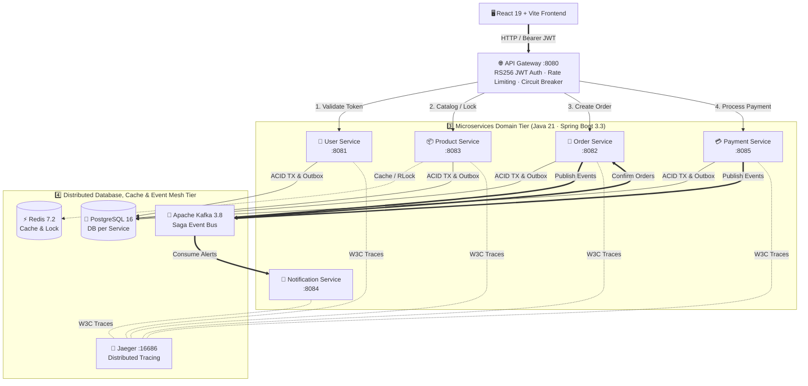
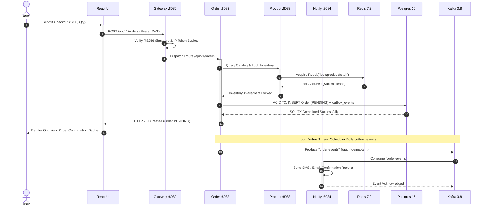
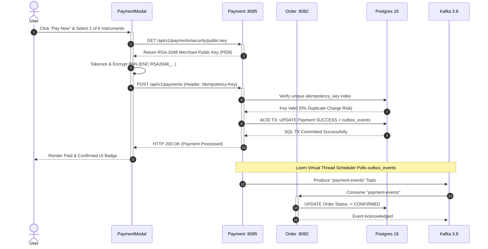
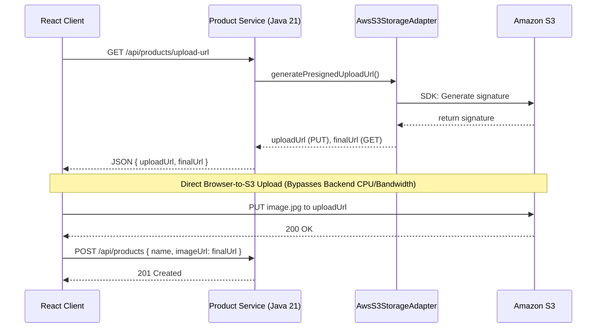

# Java 21 · Spring Boot 3.3 · Microservices Full-Stack Project

A production-ready, full-stack microservices project demonstrating a modern React frontend and a Java 21 / Spring Boot 3.3 backend with Spring Cloud, Apache Kafka (KRaft mode), Redis, and PostgreSQL.

---

## 🛠️ Tech Stack

### Frontend
| Category | Technology |
|----------|------------|
| **Core** | React 18 + Vite 5 |
| **Routing** | React Router v6 |
| **State** | TanStack Query v5 |
| **Forms** | React Hook Form |
| **HTTP** | Axios + JWT Interceptors |

### Backend & Infrastructure
| Category | Technology |
|----------|------------|
| **Backend** | Java 21 + Spring Boot 3 |
| **Gateway** | Spring Cloud Gateway |
| **Messaging** | Apache Kafka |
| **Database** | PostgreSQL 16 |
| **Cache** | Redis 7 |
| **Containers** | Docker (Multi-stage builds) |
| **Orchestration**| Kubernetes |
| **K8s Packaging**| Helm (Bitnami Charts) |

### Backend Microservices & Ports
| Service | Port | Description |
|---------|------|-------------|
| **API Gateway** | `8080` | Single entry point, RS256 JWT auth, CORS, Rate limiting, Circuit breakers |
| **User Service** | `8081` | Authentication, Registration, JWT issuance, RBAC claims |
| **Order Service** | `8082` | Order lifecycle, Saga Outbox pattern, BFF Aggregator (`/api/v1/aggregator/**`) |
| **Product Service** | `8083` | SKU Catalog, `@Cacheable`, Redisson `RLock` inventory locks |
| **Notification Service** | `8084` | Idempotent Kafka event consumer, SMS/Email alerts, SSE streams |
| **Payment Service** | `8085` | PCI-DSS RSA-2048 tokenization, Idempotency keys (`X-Idempotency-Key`), 6 payment instruments |

### 🗄️ Database-per-Service & Table Mapping Matrix (16 Tables Total)

This project implements the **Database-per-Service** architectural pattern. Each stateful microservice owns its own isolated database schema to guarantee loose coupling, independent scalability, and ACID transaction boundaries without shared database dependencies.

| Service | Table Name | Java Entity | Architectural Purpose |
| :--- | :--- | :--- | :--- |
| **User Service** | `users` | `User.java` | Stores user profiles, credentials, roles, and status for Role-Based Access Control (RBAC). |
| | `refresh_tokens` | `RefreshToken.java` | Stores JWT refresh tokens for secure session management and token revocation. |
| | `outbox_events` | `OutboxEvent.java` | Implements the **Transactional Outbox Pattern** to reliably emit domain events (e.g., `UserCreatedEvent`). |
| | `audit_logs` | `AuditLog.java` | Records domain audit trails and administrative security actions. |
| | `log_rest` | `LogRest.java` | Logs HTTP REST request and response payloads for tracing and debugging. |
| **Product Service** | `products` | `Product.java` | Stores product catalog items, SKU codes, pricing, and available inventory stock. |
| | `outbox_events` | `OutboxEvent.java` | Implements the Transactional Outbox Pattern to emit product and inventory change events reliably. |
| | `audit_logs` | `AuditLog.java` | Records audit history for inventory and product catalog updates. |
| | `log_rest` | `LogRest.java` | Logs HTTP REST API traffic for observability. |
| **Order Service** | `orders` | `Order.java` | Stores order transactions, user/product IDs, quantities, order notes, and status (`PENDING`, `COMPLETED`, etc.). |
| | `outbox_events` | `OutboxEvent.java` | Implements the Transactional Outbox Pattern to publish order lifecycle events (e.g., `OrderCreatedEvent`). |
| | `audit_logs` | `AuditLog.java` | Tracks auditing history for order processing. |
| | `log_rest` | `LogRest.java` | Logs API requests and responses for troubleshooting order endpoints. |
| **Payment Service** | `payments` | `Payment.java` | Stores payment transactions, amounts, payment methods, and payment processing status. |
| | `payment_outbox` | `PaymentOutboxEvent.java` | Dedicated Transactional Outbox table for payment event publishing. |
| | `payment_audit_log`| `PaymentAuditLog.java` | Dedicated audit trail for sensitive PCI-DSS payment operations. |
| **Notification Service** | *None (Stateless)* | *N/A* | Stateless Kafka event consumer; triggers email/SMS notifications without needing relational database persistence. |
| **API Gateway** | *None (Stateless)* | *N/A* | Stateless edge routing layer; handles RS256 JWT validation, CORS, rate limiting, and circuit breakers. |

#### Why are there recurring tables (`outbox_events`, `audit_logs`, `log_rest`) across services?
- **Transactional Outbox Pattern (`outbox_events`, `payment_outbox`)**: Prevents distributed race conditions. Events are written to an outbox table within the same ACID database transaction as the primary entity (`orders`, `users`, etc.), and a background Virtual Thread publisher relays them to Apache Kafka.
- **Shared Domain Audit & Observability (`audit_logs`, `log_rest`)**: Entities defined in `common-module` are mapped into each service's individual schema to maintain compliance and HTTP request tracing per microservice.

---

## 🏗️ Architecture & Visual Sequence Blueprints

### 1. High-Level System Architecture Flowchart


### 2. Sequence Diagram 1: Secure Order Creation & Saga Choreography Flow


### 3. Sequence Diagram 2: PCI-DSS RSA-2048 Secure Payment Tokenization Flow


---

## 📚 Complete Project Working Flow Documentation Guide

For the full interactive documentation with zoom controls, offline search, architectural explanations, and interview prep cheat sheets, open **[docs/java21-microservices-guide.html](file:///d:/Projects/microservices1/Java_21_ReactJs_FullStack/docs/java21-microservices-guide.html)** or review **[docs/FULLSTACK_MICROSERVICES_INTERVIEW_ARCHITECTURE_GUIDE.md](file:///d:/Projects/microservices1/Java_21_ReactJs_FullStack/docs/FULLSTACK_MICROSERVICES_INTERVIEW_ARCHITECTURE_GUIDE.md)**:

| Section | Title | Description |
| :---: | :--- | :--- |
| **01** | **[System Architecture](file:///d:/Projects/microservices1/Java_21_ReactJs_FullStack/docs/java21-microservices-guide.html#architecture)** | End-to-end architecture overview and port mapping matrix |
| **02** | **[Visual Blueprints](file:///d:/Projects/microservices1/Java_21_ReactJs_FullStack/docs/java21-microservices-guide.html#systemdesignblueprint)** | Interactive Mermaid architecture flowchart, saga sequence, RSA payment flow & design trade-offs |
| **03** | **[Project Structure Tree](file:///d:/Projects/microservices1/Java_21_ReactJs_FullStack/docs/java21-microservices-guide.html#project)** | Full directory structure and module dependency hierarchy |
| **04** | **[Prerequisites & Tools](file:///d:/Projects/microservices1/Java_21_ReactJs_FullStack/docs/java21-microservices-guide.html#prereqs)** | JDK 21, Maven 3.9+, Docker 26+, Kubernetes EKS, and Node 20+ requirements |
| **05** | **[Java 21 & Virtual Threads](file:///d:/Projects/microservices1/Java_21_ReactJs_FullStack/docs/java21-microservices-guide.html#java21)** | Project Loom virtual threads, Records, Pattern Matching, and Sealed Interfaces |
| **06** | **[Spring Boot 3.3.2 Config](file:///d:/Projects/microservices1/Java_21_ReactJs_FullStack/docs/java21-microservices-guide.html#springboot)** | Application properties, profiles, actuators, and resilience configuration |
| **07** | **[Docker Infrastructure Stack](file:///d:/Projects/microservices1/Java_21_ReactJs_FullStack/docs/java21-microservices-guide.html#docker)** | Local Docker Compose setup for PostgreSQL 16, Redis 7.2, Kafka 3.8, and Jaeger |
| **08** | **[Apache Kafka 3.8 Mesh](file:///d:/Projects/microservices1/Java_21_ReactJs_FullStack/docs/java21-microservices-guide.html#kafka)** | Event-driven outbox messaging, KRaft mode, and idempotent topics |
| **09** | **[Redis 7.2 Caching & Lock](file:///d:/Projects/microservices1/Java_21_ReactJs_FullStack/docs/java21-microservices-guide.html#redis)** | Distributed `@Cacheable` caching, Redisson sub-ms locks, and token-bucket rate limiting |
| **10** | **[API Gateway Edge (:8080)](file:///d:/Projects/microservices1/Java_21_ReactJs_FullStack/docs/java21-microservices-guide.html#apigateway)** | RS256 JWT security filter, CORS deduplication, and Resilience4j circuit breakers |
| **11** | **[Domain Microservices Code](file:///d:/Projects/microservices1/Java_21_ReactJs_FullStack/docs/java21-microservices-guide.html#services)** | Deep-dive walkthrough of `user`, `product`, `order` (Saga), and `notification` services |
| **12** | **[Payment Service (PCI-DSS)](file:///d:/Projects/microservices1/Java_21_ReactJs_FullStack/docs/java21-microservices-guide.html#paymentservice)** | RSA-2048 public/private cryptography, 6 payment instruments, and idempotency guard |
| **13** | **[UI Integration & Testing](file:///d:/Projects/microservices1/Java_21_ReactJs_FullStack/docs/java21-microservices-guide.html#testing)** | React 19 Vite integration (`OrdersPage.jsx`, `PaymentModal.jsx`) and regression test suites |
| **14** | **[Kubernetes Architecture](file:///d:/Projects/microservices1/Java_21_ReactJs_FullStack/docs/java21-microservices-guide.html#kubernetes)** | Production K8s manifests, NGINX Ingress controller, and Horizontal Pod Autoscalers |
| **15** | **[AWS Cloud Provisioning](file:///d:/Projects/microservices1/Java_21_ReactJs_FullStack/docs/java21-microservices-guide.html#aws)** | AWS EKS, ECR, RDS Postgres, and IAM security provisioning |
| **16** | **[CI/CD Production Pipeline](file:///d:/Projects/microservices1/Java_21_ReactJs_FullStack/docs/java21-microservices-guide.html#deployment)** | Automated GitHub Actions CI/CD pipeline and rolling zero-downtime deployment |
| **17** | **[Interview Master Cheat Sheet](file:///d:/Projects/microservices1/Java_21_ReactJs_FullStack/docs/java21-microservices-guide.html#interviewcheatsheet)** | Comprehensive interview review covering SOLID, ACID, CAP, Saga, Outbox, and Keycloak FAQs |
| **18** | **[RBAC & Integration Test Suite](file:///d:/Projects/microservices1/Java_21_ReactJs_FullStack/docs/RBAC_INTEGRATION_TEST_SCENARIOS.md)** | Full-stack role-based access control test scenarios for Admin and Regular User roles across all modules |

### Dynamic Dashboard Visualization
The frontend React application features a natively coded (CSS/HTML) **Dynamic Architecture Dashboard** on its Login screen, visually representing this entire microservice structure with animated real-time data flows to demonstrate system topology to users immediately upon entry.

---

## 🌟 Benefits of the Tech Stack

- **Java 21 & Spring Boot 3.3**: Brings Virtual Threads (Project Loom) for massive throughput and high concurrency with minimal resource overhead. Pattern matching and Records reduce boilerplate and improve code readability.
- **React 18 & Vite 5**: Offers lightning-fast Hot Module Replacement (HMR) and optimized builds. React 18's concurrent rendering improves perceived performance.
- **Apache Kafka (KRaft)**: Acts as the backbone for event-driven asynchronous communication, decoupling microservices and ensuring reliable message delivery without the Zookeeper overhead.
- **PostgreSQL 16**: Provides robust, ACID-compliant relational data storage with advanced JSONB capabilities.
- **Redis 7**: Ensures high-speed caching and session management, reducing database load and latency.
- **Spring Cloud Gateway**: Serves as a single entry point, handling routing, cross-cutting concerns like security (JWT validation), rate limiting, and CORS.

---

## 🛡️ Industry Best Practices

### Scalability
- **Stateless Services**: All microservices are entirely stateless; session and state are managed externally (Redis/PostgreSQL). This allows horizontal pod autoscaling.
- **Event-Driven Architecture**: Heavy or non-blocking operations (like sending notifications) are offloaded to Kafka, ensuring the main thread returns quickly to the user.
- **Virtual Threads**: Enabled in Spring Boot 3, allowing each service to handle tens of thousands of concurrent requests without thread-pool exhaustion.

## 🔒 Security Implementation

Security in this architecture follows a **Zero-Trust** model at the network boundary.

### 1. API Gateway as a Shield
- **Centralized Authentication**: The `api-gateway` uses a Global Filter to intercept every incoming request. It extracts the JWT, verifies the signature, and rejects invalid tokens before they ever reach a backend service.
- **Distributed Rate Limiting**: Uses **Redis** (`RequestRateLimiter`) to enforce strict rate limits per IP address, preventing DDoS attacks and API abuse.
- **OAuth2 & Keycloak**: Includes an optional profile to run as an OAuth2 Resource Server, integrating seamlessly with external Identity Providers like Keycloak.
- **Header Propagation**: Once a token is validated, the Gateway extracts the `userId` and `roles` and appends them as trusted HTTP headers (`X-User-Id`) to the downstream request. Backend services implicitly trust these headers since they are hidden behind the Gateway.

### Reliability
- **Circuit Breakers & Retries**: Implemented across inter-service communication to prevent cascading failures.
- **Health Checks & Actuators**: Spring Boot Actuator exposes `/actuator/health` and `/actuator/metrics`, allowing orchestrators like Kubernetes to automatically restart unhealthy instances.
- **Idempotency**: Kafka consumers are designed to be idempotent to handle 'at-least-once' delivery guarantees without data duplication.

### Maintainability
- **Clean Architecture**: Separation of concerns using Controller, Service, and Repository layers. DTOs (using Java Records) isolate the domain model from external API changes.
- **Automated Migrations**: Flyway tracks and manages database schema changes through versioned scripts, preventing drift across environments.
- **Centralized Configuration**: Environment variables and config maps drive behavior, keeping the code environment-agnostic (12-Factor App methodology).

---

## 💡 Guidelines for Codebase Excellence

To keep this project at the pinnacle of industry standards, follow these guidelines:
1. **Embrace Immutability**: Use Java Records for all DTOs and events. Avoid setter methods in entities where possible; favor constructor-based initialization and builder patterns.
2. **Keep Bounded Contexts Strict**: Services should never share a database. If `order-service` needs user data, it must query `user-service` via API or react to Kafka events.
3. **Comprehensive Testing**: Maintain high test coverage. Use **Testcontainers** for integration tests to validate against real PostgreSQL/Kafka instances instead of mock databases.
4. **API Versioning**: When introducing breaking changes, version your endpoints (e.g., `/api/v1/orders` to `/api/v2/orders`) to ensure backward compatibility for clients.
5. **Observability First**: Use distributed tracing (like Micrometer Tracing with Zipkin or Jaeger) and centralized logging (ELK stack or Loki) to track requests across service boundaries.
6. **Continuous Dependency Updates**: Regularly update Maven and npm dependencies to patch security vulnerabilities and leverage performance improvements.

---

## 🧩 High-Level Design (HLD) & Design Patterns

### 1. Enterprise Architecture Patterns
| Challenge / Concept | How it was achieved in this project |
|---------------------|-------------------------------------|
| **API Gateway Pattern** | `api-gateway` acts as a single entry point, encapsulating routing, JWT validation, and CORS. |
| **Distributed Transaction** | Used **Saga Pattern** + **Outbox Pattern**. Both the `order-service` and `product-service` write Saga events to local Outbox tables inside a single `@Transactional` block to prevent the Dual-Write problem. |
| **Fault Tolerance** | Used **Circuit Breaker**, **Retry**, and **Fallback** (Resilience4j) to fail fast on remote service outages. |
| **Bulkhead Pattern** | Limited concurrent requests/threads to isolate failures and prevent cascading thread exhaustion. |
| **Publish-Subscribe** | Used **Apache Kafka** for asynchronous, event-driven choreographies (e.g., Notifications). |
| **Distributed Locking**| Used **Redisson (`RLock`)** in the `product-service` to safely handle concurrent inventory decrements across multiple pods. |
| **Scalability** | Used **Java 21 Virtual Threads**, Redis caching, and Kubernetes HPA for massive horizontal scale. |
| **Reliability (Zero Data Loss)** | Implemented **Redis Idempotency** in consumers to guarantee exactly-once processing, and **Dead Letter Queues (DLQ)** by throwing `RuntimeExceptions` back to Kafka for automated retries. |
| **Availability** | Achieved via Kubernetes ReplicaSets, API Gateway fallbacks, and stateless design. |
| **Readability** | Ensured via Java Records (no boilerplate), MapStruct, and clean separation of concerns. |
| **Maintainability** | Enforced strictly decoupled bounded contexts, Flyway migrations, and centralized logging. |
| **Load Balancing** | Handled seamlessly by Kubernetes Services distributing traffic across multiple pod instances. |
| **Routing** | Managed dynamically by **Spring Cloud Gateway** using URL path predicates. |
| **Service Discovery** | Server-side discovery utilizing native Kubernetes DNS. |
| **SOLID Principles** | Applied strictly (e.g., Single Responsibility in `@Service` classes, Dependency Inversion via Spring IoC). |
| **Isolation** | Database isolation managed via `@Transactional`; Network isolation via Kubernetes internal network. |
| **Caching** | Used **Redis** to offload heavy read queries and manage distributed rate-limiting. |
| **ACID & Transactions**| Enforced locally within bounded contexts via PostgreSQL and Spring's declarative `@Transactional`. |
| **Connection Pooling** | Tuned **HikariCP** (`maximum-pool-size=50`) explicitly to prevent connection starvation when using Virtual Threads for high-throughput blocking I/O. |
| **Spring Data JPA** | Used for ORM; leveraging entity relationships, automatic query generation, and lazy loading. |
| **Spring Security** | Implemented Zero-Trust via **API Gateway**, utilizing JWTs/OAuth2 and downstream role propagation. |
| **Internationalization (i18n)** | Global Exception Handlers utilize `MessageSource` and Resource Bundles to dynamically localize error messages based on the `Accept-Language` HTTP header. |
| **Generics & DRY** | Standardized `ApiResponse<T>` wrapper eliminates duplicate response mapping across all 5 microservices. |
| **Reactive Programming** | **Spring Cloud Gateway (WebFlux)** leverages `Mono` and `Flux` to handle tens of thousands of concurrent connections without thread blocking, while backend services stick to Virtual Threads. |

### 2. Code-Level (GoF) Design Patterns
- **Dependency Injection (IoC):** The core of Spring Boot. Services, Controllers, and Repositories are decoupled and injected at runtime.
- **Proxy Pattern:** Heavily utilized by Spring AOP for our **Audit Logging** and by `@Transactional` to manage DB commits/rollbacks transparently.
- **Data Transfer Object (DTO):** Strictly enforced using **Java 21 Records** to transfer immutable data between layers without exposing DB Entities.
- **Factory / Mapper Pattern:** Utilized via **MapStruct**, which generates factory-like mapper classes to convert Entities to DTOs efficiently.
- **Facade Pattern:** Our `@Service` classes act as facades, hiding complex interactions with Repositories, Kafka Templates, and remote clients from the Controllers.
- **Singleton Pattern:** By default, all Spring Beans (Controllers, Services) are instantiated as thread-safe Singletons per JVM context.

---

## 🏷️ Key Annotations & Core Components

To navigate this codebase effectively, you should understand the primary Spring Boot 3 annotations and components we utilized:

### Inter-Service Communication
- **`RestClient`**: The modern, fluent Spring Boot 3 alternative to `RestTemplate`. We use this specifically (e.g., in `AggregatorController`) to make asynchronous, non-blocking HTTP calls to downstream services to aggregate data efficiently.

### Resiliency & Fault Tolerance (Resilience4j)
- **`@CircuitBreaker`**: Prevents cascading failures by opening the circuit when a threshold of remote calls fail.
- **`@Retry`**: Automatically retries failed synchronous API calls a specified number of times before giving up.
- **`@TimeLimiter`**: Enforces strict timeout limits on asynchronous/future calls to ensure threads are not blocked indefinitely.

### Asynchronous Messaging & Zero Data Loss
- **`@KafkaListener`**: Placed on methods in our consumer services to asynchronously ingest messages from Kafka topics (e.g., `order-events`).
- **Distributed Idempotency Guard**: Consumers utilize `RedissonClient` to set atomic lock keys (`idempotency:saga:order:{id}`) ensuring that if a pod crashes mid-execution, a message is never processed twice.
- **Dead Letter Queues (DLQ)**: By strictly throwing `RuntimeException` for unexpected errors, we trigger Spring Kafka's retry mechanics and automatic `.DLT` routing for poison pills, guaranteeing zero data loss.

### Data & Transactions
- **`@Transactional`**: Applied at the service layer to ensure local database operations (like saving an Order and inserting into an Outbox table) either fully succeed or completely rollback.

### Aspect-Oriented Programming (AOP)
- **`@Aspect` & `@Around`**: Used to define our centralized audit logging. It intercepts methods to track business operations without cluttering the core logic.

### Global Exception Handling
- **`@RestControllerAdvice` & `@ExceptionHandler`**: Intercepts exceptions (like `UserNotFoundException` or `RestClientResponseException`) thrown anywhere in the application and converts them into standardized JSON error responses.

### Code Generation
- **`@Mapper`**: A MapStruct annotation that automatically generates high-performance Factory classes at compile-time to map database Entities to immutable DTO Records.

---

## 📦 Project Structure

```
microservices-demo/
├── pom.xml                       ← Parent POM (Java 21, Spring Boot 3.3.2)
├── docker-compose.yml            ← Full stack (infra + services)
├── docker-compose-infra.yml      ← Infra only (for local IDE dev)
├── README.md
│
├── api-gateway/                  ← Spring Cloud Gateway (:8080)
├── user-service/                 ← Auth, JWT, User profiles (:8081)
├── order-service/                ← Orders, Kafka producer (:8082)
├── product-service/              ← Product catalog, inventory (:8083)
├── notification-service/         ← Kafka consumer, notifications (:8084)
├── payment-service/              ← Payments, Outbox, RSA-2048 cryptograms (:8085)
│
└── k8s/                          ← Kubernetes manifests
    ├── namespace.yml
    ├── configmap.yml
    ├── secrets.yml
    ├── api-gateway.yml
    └── microservices.yml
```

---

## 🔧 Prerequisites

| Tool | Version | Purpose |
|------|---------|---------|
| Java JDK | 21 LTS | Runtime |
| Maven | 3.9+ | Build |
| Docker Desktop | 26+ | Containers |
| kubectl | 1.30+ | K8s CLI (prod) |

---

## 🚀 Quick Start — Local Development

### Option 1: IDE + Infra Docker (Recommended)

```bash
# 1. Clone the repository
git clone <repo-url>
cd microservices-demo

# 2. Start infrastructure only (PostgreSQL, Redis, Kafka KRaft, Kafka UI — NO Zookeeper)
docker compose -f docker-compose-infra.yml up -d

# 3. Build all modules
mvn clean package -DskipTests
```

#### 4. Start Backend Services

**For Windows Users (Recommended):**
We provide utility PowerShell scripts in the root directory to manage the microservices:
```powershell
.\start-all.ps1    # Starts all services sequentially in new windows and waits for health checks
.\stop-all.ps1     # Stops all microservices running on their respective ports
.\restart-all.ps1  # Stops and then restarts all services
.\start-down.ps1   # Scans for services that are down and starts only those
```

**Manual Startup (Linux/Mac/Windows):**
Start each service in a separate terminal window:
```bash
cd user-service && mvn spring-boot:run
cd order-service && mvn spring-boot:run
cd product-service && mvn spring-boot:run
cd notification-service && mvn spring-boot:run
cd payment-service && mvn spring-boot:run
cd api-gateway && mvn spring-boot:run
```

#### 5. Start Frontend Application

The React frontend application is located in the `frontend` directory.

```bash
cd ../frontend
npm install
npm run dev
```
Access the application in your browser at `http://localhost:3000`.

### Option 2: Full Docker Compose

```bash
# Build all images and start everything
mvn clean package -DskipTests
docker compose up --build -d

# Check logs
docker compose logs -f api-gateway
docker compose logs -f user-service
```

---

## 🗃️ Database Configuration

All services connect to a single PostgreSQL instance:

| Parameter | Value |
|-----------|-------|
| Host | `localhost:5432` |
| Database | `engine` |
| Username | `postgres` |
| Password | `postgres` |

**Schema migrations are handled by Flyway** — tables are created automatically on startup.

---

## 🔐 Security Architecture & Implementation

We achieve robust, scalable security by following a "defense-in-depth" philosophy coupled with centralized authentication:

1. **Centralized Authentication (API Gateway)**
   - The `api-gateway` acts as a single point of entry for all incoming traffic.
   - It utilizes a Global Authentication Filter that intercepts every request (except public routes) to validate the presence and integrity of a JWT Bearer token.
   - Unauthenticated or malformed requests are instantly rejected with a `401 Unauthorized`, ensuring malicious traffic never reaches the backend microservices.

2. **Stateless JWT Authorization**
   - The `user-service` is responsible for issuing cryptographically signed JSON Web Tokens (JWTs) using a secure `JWT_SECRET`.
   - Because tokens are stateless, we achieve infinite horizontal scalability without needing sticky sessions or distributed session replication.
   - The Gateway parses the JWT, extracts claims (like `userId`), and securely propagates them via HTTP headers to downstream services.

3. **Data Protection & Hashing**
   - Passwords are never stored in plaintext. They are salted and hashed using the strong **BCrypt** algorithm (strength/work factor of 12) during registration.
   - This prevents brute-force and rainbow table attacks even in the event of a database compromise.

4. **Network Isolation (Docker/Kubernetes)**
   - Only the API Gateway is exposed to the public web (Port 8080 / 443).
   - Downstream microservices, PostgreSQL databases, Redis caches, and Kafka brokers are bound to private internal networks. They cannot be accessed directly from the internet.

5. **Cross-Origin Resource Sharing (CORS)**
   - Configured globally at the API Gateway level to only allow requests from trusted origins (like our React frontend on `localhost:3000`), mitigating cross-site request forgery (CSRF) attacks.

### Public Endpoints (no JWT required)
```
POST /api/auth/register   ← Register a new user
POST /api/auth/login      ← Login and get JWT
GET  /actuator/health     ← Health check
```

---

## 📋 API Reference

### Authentication

```bash
# Register
curl -X POST http://localhost:8080/api/auth/register \
  -H "Content-Type: application/json" \
  -d '{"fullName":"John Doe","email":"john@example.com","password":"Secret123!"}'

# Login
curl -X POST http://localhost:8080/api/auth/login \
  -H "Content-Type: application/json" \
  -d '{"email":"john@example.com","password":"Secret123!"}'
# Response: {"success":true,"data":{"accessToken":"eyJ...","tokenType":"Bearer",...}}
```

### Orders (requires JWT)

```bash
TOKEN="eyJ..." # from login response

# Create order
curl -X POST http://localhost:8080/api/orders \
  -H "Authorization: Bearer $TOKEN" \
  -H "Content-Type: application/json" \
  -d '{
    "userId": "uuid-of-user",
    "productId": "uuid-of-product",
    "quantity": 2,
    "totalPrice": 59.98
  }'

# Get order
curl http://localhost:8080/api/orders/{id} \
  -H "Authorization: Bearer $TOKEN"

# Get user's orders
curl http://localhost:8080/api/orders/user/{userId} \
  -H "Authorization: Bearer $TOKEN"
```

### Products

```bash
# Get all products (paginated)
curl "http://localhost:8080/api/products?page=0&size=10"

# Get by category
curl http://localhost:8080/api/products/category/Electronics

# Decrement stock (after order)
curl -X PUT "http://localhost:8080/api/products/{id}/stock/decrement?qty=1" \
  -H "Authorization: Bearer $TOKEN"
```

### Payments & Security (requires JWT)

```bash
# Get Merchant RSA-2048 Public Key PEM (for client-side card tokenization)
curl http://localhost:8080/api/v1/payments/security/public-key \
  -H "Authorization: Bearer $TOKEN"

# Process payment (Credit Card with RSA cryptogram / UPI / NetBanking / Wallet / BNPL / EMI)
curl -X POST http://localhost:8080/api/v1/payments \
  -H "Authorization: Bearer $TOKEN" \
  -H "Content-Type: application/json" \
  -d '{
    "orderId": 100,
    "userId": 1,
    "amount": 99.99,
    "currency": "USD",
    "paymentMethod": "CREDIT_CARD",
    "idempotencyKey": "IDEM-CC-001",
    "cardLast4": "4242",
    "cardBrand": "VISA",
    "gatewayProvider": "STRIPE_SIMULATOR"
  }'

# Refund payment
curl -X POST http://localhost:8080/api/v1/payments/{id}/refund \
  -H "Authorization: Bearer $TOKEN" \
  -H "Content-Type: application/json" \
  -d '{"reason":"Customer cancellation","amount":99.99}'
```

---

## ☕ Java 21 Features Used

| Feature | Location |
|---------|----------|
| **Records** | All DTOs: `OrderRequest`, `UserResponse`, `JwtResponse`, `OrderEvent`, `ProductResponse`, `NotificationMessage`, `PaymentRequest`, `PaymentResponse` |
| **Pattern matching switch** | `OrderResponse.from()`, `OrderService.validateTransition()`, `ProductResponse.from()`, `NotificationService.dispatch()`, `OrderEventConsumer.processOrderEvent()`, `PaymentInstrument` sealed hierarchy, `SimulatedPaymentGatewayProvider.charge()` |
| **Text blocks** | `NotificationService` email templates, `GatewayExceptionHandler` JSON body, `PaymentCryptographyService` PEM keys |
| **Virtual threads** | `spring.threads.virtual.enabled=true` in all services |
| **Sealed types & interfaces** | `OrderStatus` lifecycle state machine, `PaymentInstrument` (Card, UPI, NetBanking, Wallet, BNPL, EMI, Mandate), `GatewayExecutionResult` |
| **Guarded patterns** | `ProductResponse.from()` stock level switch |

---

## 🐳 Docker

Each service has a multi-stage Dockerfile:
1. **Stage 1 (builder)**: `eclipse-temurin:21-jdk-alpine` + Maven build
2. **Stage 2 (runtime)**: `eclipse-temurin:21-jre-alpine` with non-root user

**Kafka**: Uses `apache/kafka:3.8.0` in **KRaft mode** — no Zookeeper required.  
**JVM flags**: `-XX:+UseZGC -XX:+ZGenerational` (low-latency GC for Java 21)

---

## ☸️ Kubernetes Deployment

```bash
# Create namespace
kubectl apply -f k8s/namespace.yml

# Create ConfigMap and Secrets
# Note: Ensure you edit k8s/secrets.yml to provide your base64 encoded MAIL_PASS before applying
kubectl apply -f k8s/configmap.yml
kubectl apply -f k8s/secrets.yml

# Deploy infrastructure (PostgreSQL, Redis, Kafka via Helm)
helm repo add bitnami https://charts.bitnami.com/bitnami
helm install postgres bitnami/postgresql -n microservices \
  --set auth.username=postgres \
  --set auth.password=postgres \
  --set auth.database=engine

helm install redis bitnami/redis -n microservices \
  --set auth.enabled=false

helm install kafka bitnami/kafka -n microservices \
  --set kraft.enabled=true \
  --set zookeeper.enabled=false

# Deploy services
kubectl apply -f k8s/api-gateway.yml
kubectl apply -f k8s/microservices.yml

# Check status
kubectl get pods -n microservices
kubectl get services -n microservices
```

---

## ☁️ AWS Production Architecture Mapping

While the Kubernetes manifests above run the entire stack (including databases and message brokers) inside the cluster for development/testing, a true enterprise **AWS Production Environment** should offload stateful services to managed AWS offerings.

To deploy this project to AWS securely and reliably, map the components as follows:

| Local / K8s Helm Chart | Managed AWS Service | Benefits |
|------------------------|---------------------|----------|
| **Kubernetes (Compute)** | **Amazon EKS** (Elastic Kubernetes Service) | Manages the control plane. Use Fargate or managed EC2 node groups for the Spring Boot microservices. |
| **PostgreSQL** | **Amazon RDS for PostgreSQL** | Automated backups, Multi-AZ high availability, and simplified scaling outside the K8s cluster. |
| **Redis** | **Amazon ElastiCache for Redis** | Fully managed, sub-millisecond latency for the API Gateway rate limiter and product cache. |
| **Apache Kafka** | **Amazon MSK** (Managed Streaming for Apache Kafka) | Serverless or provisioned Kafka clusters without the operational overhead of managing KRaft/Zookeeper nodes. |
| **K8s Secrets** | **AWS Secrets Manager** | Instead of static `secrets.yml`, use the AWS Secrets and Configuration Provider (ASCP) to mount secrets dynamically into EKS pods. |
| **Docker Registry** | **Amazon ECR** (Elastic Container Registry) | Store the multi-stage Docker images (`your-ecr-repo/user-service:latest`). |
| **API Gateway LoadBalancer**| **AWS ALB** (Application Load Balancer) | Map the K8s `LoadBalancer` service to an AWS ALB using the AWS Load Balancer Controller for WAF integration and SSL termination. |

**AWS Deployment Strategy:**
1. Provision VPC, RDS, ElastiCache, and MSK using Terraform or AWS CDK.
2. Update the `k8s/configmap.yml` to point `DB_URL`, `REDIS_HOST`, and `KAFKA_BROKERS` to the respective AWS internal endpoints.
3. Apply the stateless microservices (`k8s/api-gateway.yml` and `k8s/microservices.yml`) to EKS.

### S3 Direct Upload Architecture (Hexagonal)
The `product-service` utilizes the **Ports & Adapters (Hexagonal)** architecture to seamlessly integrate AWS S3 Presigned URLs for file uploads without forcing local developers to have AWS credentials.



### Distributed Locking Architecture (Redisson + AOP)
To prevent race conditions in highly concurrent scenarios (e.g., two users purchasing the last item simultaneously), the `product-service` utilizes Redis Distributed Locks via Redisson. We abstracted this into a custom `@DistributedLock` annotation and a Spring AOP Aspect, resulting in flawlessly synchronized, boilerplate-free business logic.

```java
@Transactional
@DistributedLock(keyPrefix = "lock:inventory:")
public void deductStock(Long id, int quantity) {
    // Perfectly synchronized across all service instances!
    // ...
}
```

---

## 🔗 Quick Access URLs

### 📊 Observability & Infrastructure Dashboards
- **Grafana (Metrics Dashboard)**: [http://localhost:3001](http://localhost:3001) *(Default Login: `admin` / `admin`)*
- **Prometheus (Metrics Scraper)**: [http://localhost:9090](http://localhost:9090)
- **Jaeger UI (Distributed Tracing)**: [http://localhost:16686](http://localhost:16686)
- **Kafka UI (Topic & Message Browser)**: [http://localhost:9093](http://localhost:9093)

### 🌐 Application & Gateway
- **React Frontend App**: [http://localhost:3000](http://localhost:3000)
- **API Gateway (Main Entrypoint)**: [http://localhost:8080](http://localhost:8080)

### ⚙️ Direct Microservice Ports (Bypassing Gateway)
- **User Service**: `http://localhost:8081`
- **Order Service**: `http://localhost:8082`
- **Product Service**: `http://localhost:8083`
- **Notification Service**: `http://localhost:8084`

---

## 🧪 Testing

```bash
# Unit tests
mvn test

# Integration tests (requires Docker)
mvn verify

# Single service tests
cd user-service && mvn test
```

---

## 📊 Observability & Monitoring

This project embraces a comprehensive observability strategy, ensuring every aspect of the system's behavior is traceable, measurable, and resilient.

### 1. Distributed Tracing (Micrometer & OpenTelemetry)
- **Dependencies**: `micrometer-tracing-bridge-otel` and `opentelemetry-exporter-otlp` (configured in `common-module`).
- **Purpose**: Tracks a single user request as it traverses through the API Gateway, into various microservices, and across Kafka events. A unique `traceId` is attached to every log statement, making cross-service debugging seamless.

### 2. Application Metrics & Health Checks
- **Spring Boot Actuator**: Included globally via `spring-boot-starter-actuator`.
- **Health Checks**: Available at `http://localhost:8080/actuator/health` (Gateway) and port-specific endpoints for individual services. Kubernetes uses these endpoints for liveness and readiness probes.
- **Metrics**: Exposed at `/actuator/metrics` for deep JVM and application-level insights.

### 3. API Documentation & Observability
- **OpenAPI / Swagger UI**: Integrated using `springdoc-openapi-starter-webmvc-ui`.
- **Purpose**: Provides a live, interactive UI to observe API contracts, schemas, and test endpoints directly without external tools.

### 4. Chaos Engineering
- **Spring Boot Chaos Monkey**: Included via `chaos-monkey-spring-boot`.
- **Purpose**: Proactively injects latency, exceptions, and unexpected behaviors into the application during testing to validate the resilience of Circuit Breakers and fallback mechanisms.

### 5. Audit Logging (Spring AOP)
- **Aspect-Oriented Programming**: Uses `spring-boot-starter-aop`.
- **Purpose**: Centralized Audit Aspects intercept specific method executions to automatically log critical business operations (like Order creation or User login) without cluttering the core business logic.

### 6. Infrastructure Dashboards
- **Eureka Dashboard**: Accessible at `http://localhost:8761` (if enabled in non-K8s environments) to monitor service registry health.
- **Kafka UI**: Accessible at `http://localhost:9093` to observe topics, consumer groups, and message flows in real-time.

---

## 🛠️ Configuration Reference

| Variable | Default | Description |
|----------|---------|-------------|
| `DB_URL` | `jdbc:postgresql://localhost:5432/engine` | PostgreSQL JDBC URL |
| `DB_USER` | `postgres` | Database username |
| `DB_PASS` | `postgres` | Database password |
| `REDIS_HOST` | `localhost` | Redis hostname |
| `KAFKA_BROKERS` | `localhost:9092` | Kafka bootstrap servers |
| `JWT_SECRET` | dev default | 64-byte hex JWT signing key |
| `MAIL_PASS` | (empty) | SMTP Password for Notification Service (Injected via K8s Secrets) |

---

## 📄 License

MIT License — free to use for learning and production.
