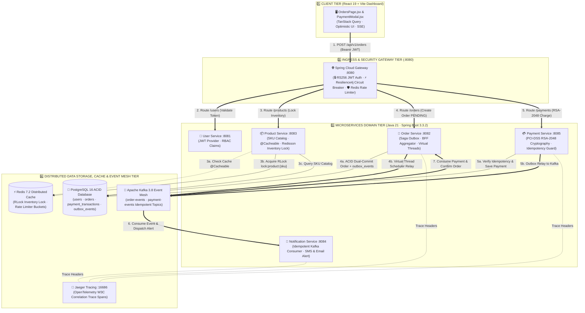
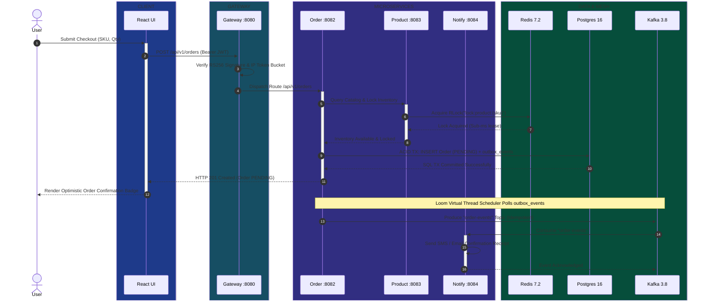
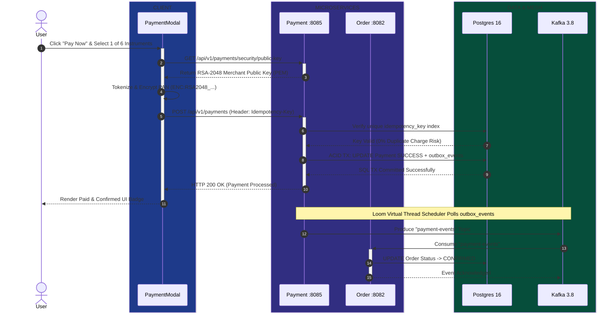

# Full-Stack Microservices & Cloud-Native Architecture: Master Interview & Technical Guide

This document is an exhaustive, authoritative guide to the architecture, design patterns, technology stack, and cloud-native infrastructure implemented in the **Java 21 / Spring Boot 3 Microservices & React Full-Stack Application**. It is designed to serve as both an **enterprise architectural reference** and a **complete interview preparation masterclass**.

---

## Table of Contents
1. [End-to-End System Architecture (Visual Diagrams)](#1-end-to-end-system-architecture-visual-diagrams)
2. [Fundamental Microservice Design Patterns](#2-fundamental-microservice-design-patterns)
3. [Backend Technology Stack & Java 21 Features](#3-backend-technology-stack--java-21-features)
4. [Frontend Technology Stack & UI/UX Best Practices](#4-frontend-technology-stack--uiux-best-practices)
5. [Data, Messaging & Security Infrastructure](#5-data-messaging--security-infrastructure)
6. [DevOps, Kubernetes & Deployment Strategies](#6-devops-kubernetes--deployment-strategies)
7. [Top 10 Interview Q&A Cheatsheet](#7-top-10-interview-qa-cheatsheet)

---

## 1. End-to-End System Architecture (Visual Diagrams)

### 1.1 Full-Stack Vertical Container & Service Topology



### 1.2 Event-Driven Saga & Transactional Outbox Workflow



### 1.3 PCI-DSS RSA-2048 Secure Payment Tokenization Flow



---

## 2. Fundamental Microservice Design Patterns

### 2.1 Database-per-Service Pattern
* **Concept:** Each microservice has its own isolated database schema. No microservice is allowed to read or write directly to another microservice's database tables.
* **Why Used:** Eliminates coupling between services, allows independent scaling, and enables schema evolution without breaking neighboring services.
* **Project Example:**
  - `user-service` connects solely to `user_db`.
  - `order-service` connects solely to `order_db`.
  - `product-service` connects solely to `product_db`.
  *If `Order Service` needs user information, it must query `User Service` via REST/RPC or consume Kafka domain events.*

---

### 2.2 Transactional Outbox Pattern
* **Concept:** Solves the **Dual-Write Problem** in distributed systems. When a service modifies its database and needs to publish an event to Kafka, writing to both targets independently can cause inconsistency if the database succeeds but Kafka crashes (or vice versa).
* **How It Works:**
  1. Within a single local database transaction (`@Transactional`), the service inserts the primary entity (e.g., `orders`) AND an event record into an `outbox_events` table.
  2. Because both writes occur in one database transaction, either both commit or both roll back atomically.
  3. A background daemon (or outbox relay scheduler) polls the `outbox_events` table and publishes the messages to Kafka, marking them `"SENT"` upon delivery.
* **Project Code Example ([OrderService.java](file:///d:/Projects/microservices/Java21_Springboot_Microservices/Java_21_Microservices_FullStack_Guide/order-service/src/main/java/com/demo/order/service/OrderService.java)):**
```java
@Transactional
public Order createOrder(CreateOrderRequest request, String userId) {
    Order order = orderRepository.save(new Order(userId, request.getProductId(), request.getQty()));
    
    // Atomic Outbox Event creation within the same DB transaction
    OutboxEvent event = OutboxEvent.builder()
        .aggregateId(order.getId().toString())
        .eventType("ORDER_CREATED")
        .payload(objectMapper.writeValueAsString(order))
        .status(OutboxStatus.PENDING)
        .build();
    outboxRepository.save(event);
    
    return order;
}
```

---

### 2.3 Saga Pattern (Choreography vs. Orchestration)
* **Concept:** A pattern for maintaining data consistency across multiple microservices without two-phase commit (2PC) distributed locks. A Saga is a sequence of local transactions where each step publishes an event that triggers the next step. If a step fails, **Compensating Transactions** are executed backwards to undo preceding steps.
* **In This Project:** We implement an event-driven **Saga Choreography**:
  - `Order Service` emits `ORDER_CREATED`.
  - `Product Service` listens to `ORDER_CREATED`, attempts inventory deduction.
  - If stock is insufficient, `Product Service` emits `INVENTORY_REJECTED`.
  - `Order Service` listens to `INVENTORY_REJECTED` and runs a compensating transaction to mark the order as `CANCELLED`.

---

### 2.4 API Gateway Pattern (Spring Cloud Gateway)
* **Concept:** A single entry point for all frontend traffic that encapsulates internal microservice network topology, routes requests, and enforces cross-cutting concerns (authentication, CORS, rate limiting, and circuit breaking).
* **Project Example ([application.yml](file:///d:/Projects/microservices/Java21_Springboot_Microservices/Java_21_Microservices_FullStack_Guide/api-gateway/src/main/resources/application.yml)):**
```yaml
spring:
  cloud:
    gateway:
      routes:
        - id: order-service
          uri: ${ORDER_SERVICE_URL:http://localhost:8082}
          predicates:
            - Path=/api/v1/orders/**, /api/v1/aggregator/**
          filters:
            - name: CircuitBreaker
              args:
                name: orderServiceBreaker
                fallbackUri: forward:/fallback/order
            - name: RequestRateLimiter
              args:
                redis-rate-limiter.replenishRate: 15
                redis-rate-limiter.burstCapacity: 30
```

---

### 2.5 BFF (Backend-for-Frontend) & Aggregator Pattern
* **Concept:** Instead of forcing the React browser client to make 5 separate REST calls to build a UI dashboard, an Aggregator (or BFF) microservice executes parallel calls to downstream services and merges the result into a single enriched JSON payload.
* **Project Code Example (`AggregatorService.java` using Java 21 `CompletableFuture`):**
```java
public AggregatedOrderDetails getOrderDetails(Long orderId) {
    CompletableFuture<OrderDto> orderFuture = CompletableFuture.supplyAsync(() -> 
        orderClient.getOrderById(orderId), virtualExecutor);
        
    CompletableFuture<ProductDto> productFuture = orderFuture.thenComposeAsync(order -> 
        CompletableFuture.supplyAsync(() -> productClient.getProductById(order.getProductId())), virtualExecutor);

    // Non-blocking wait for both futures to complete on Virtual Threads
    return CompletableFuture.allOf(orderFuture, productFuture).thenApply(v -> {
        return new AggregatedOrderDetails(orderFuture.join(), productFuture.join());
    }).join();
}
```

---

### 2.6 Resilience Patterns: Circuit Breaker, Retry & Bulkhead (Resilience4j)
* **Circuit Breaker:** Monitors failure rates. If more than 60% of calls fail within a sliding window, the circuit **opens** and immediately short-circuits calls to a fallback without waiting for timeouts.
* **Retry:** Automatically re-attempts idempotent GET calls on ephemeral network errors (`502 Bad Gateway`, `503 Service Unavailable`) with exponential backoff and jitter.
* **Bulkhead:** Limits concurrent executions to a specific service (e.g., max 50 concurrent calls to `Order Service`) so a slow downstream database cannot exhaust gateway thread pools and starve other routes.
* **Project Example ([application.yml](file:///d:/Projects/microservices/Java21_Springboot_Microservices/Java_21_Microservices_FullStack_Guide/api-gateway/src/main/resources/application.yml)):**
```yaml
resilience4j:
  circuitbreaker:
    configs:
      default:
        slidingWindowSize: 20
        failureRateThreshold: 60
        waitDurationInOpenState: 30000ms
  bulkhead:
    configs:
      default:
        maxConcurrentCalls: 50
        maxWaitDuration: 500ms
```

---

### 2.7 Distributed Locking Pattern (Redisson `RLock`)
* **Concept:** When multiple replicas of `Product Service` attempt to decrement stock simultaneously, standard JPA `@Version` optimistic locking can cause high retry thrashing. A distributed mutex in Redis guarantees that only one pod modifies an inventory SKU at any microsecond.
* **Project Code Example ([DistributedInventoryService.java](file:///d:/Projects/microservices/Java21_Springboot_Microservices/Java_21_Microservices_FullStack_Guide/product-service/src/main/java/com/demo/product/service/DistributedInventoryService.java#L38-L70)):**
```java
@Transactional
public boolean decrementInventory(Long productId, int quantityToDeduct) {
    RLock lock = redissonClient.getLock("lock:inventory:" + productId);
    try {
        // Try lock for 5s, hold lock for 10s max
        if (lock.tryLock(5, 10, TimeUnit.SECONDS)) {
            RBucket<Integer> bucket = redissonClient.getBucket("inventory:bucket:" + productId);
            int currentStock = bucket.get();
            if (currentStock >= quantityToDeduct) {
                bucket.set(currentStock - quantityToDeduct);
                productRepository.decrementStockInDb(productId, quantityToDeduct);
                return true;
            }
        }
    } finally {
        if (lock.isHeldByCurrentThread()) {
            lock.unlock();
        }
    }
    return false;
}
```

---

### 2.8 At-Least-Once Idempotent Consumer Pattern
* **Concept:** Message brokers like Apache Kafka guarantee **at-least-once** delivery. During network rebalances or consumer retries, the same message may be delivered twice. An idempotent consumer checks a persistent deduplication store before processing.
* **Project Code Example ([KafkaIdempotencyGuard.java](file:///d:/Projects/microservices/Java21_Springboot_Microservices/Java_21_Microservices_FullStack_Guide/common-module/src/main/java/com/demo/common/util/KafkaIdempotencyGuard.java)):**
```java
public boolean isDuplicate(String eventId) {
    String key = "idempotency:event:" + eventId;
    // setIfAbsent executes Redis SETNX (Set if Not Exists) atomically
    Boolean acquired = redisTemplate.opsForValue().setIfAbsent(key, "PROCESSED", Duration.ofHours(24));
    return Boolean.FALSE.equals(acquired); // True means already processed (duplicate!)
}
```

---

### 2.9 Distributed Tracing & Correlation ID Propagation (SLF4J MDC)
* **Concept:** In a microservices cluster, tracing a single user click across 5 separate JVM logs is impossible without a unique request identifier.
* **How It Works:** A servlet filter at the gateway extracts or generates `X-Correlation-ID` and puts it into SLF4J's Mapped Diagnostic Context (`MDC`). Log formatters prepend this ID to every line, enabling full-stack query aggregation in ELK / Loki.
* **Project Code Example ([CorrelationIdFilter.java](file:///d:/Projects/microservices/Java21_Springboot_Microservices/Java_21_Microservices_FullStack_Guide/common-module/src/main/java/com/demo/common/filter/CorrelationIdFilter.java)):**
```java
@Component
@Order(Ordered.HIGHEST_PRECEDENCE)
public class CorrelationIdFilter extends OncePerRequestFilter {
    @Override
    protected void doFilterInternal(HttpServletRequest req, HttpServletResponse resp, FilterChain chain) 
            throws ServletException, IOException {
        String correlationId = req.getHeader("X-Correlation-ID");
        if (!StringUtils.hasText(correlationId)) {
            correlationId = UUID.randomUUID().toString();
        }
        try {
            MDC.put("correlationId", correlationId);
            resp.setHeader("X-Correlation-ID", correlationId);
            chain.doFilter(req, resp);
        } finally {
            MDC.remove("correlationId"); // Prevent thread-local memory leak
        }
    }
}
```

---

### 2.10 IDOR (Insecure Direct Object Reference) Ownership Security
* **Concept:** Even if a user has a valid JWT, they must not be allowed to inspect or manipulate data belonging to another user.
* **Project Example:** In `OrderController` and `AggregatorController`, the backend checks whether the `userId` of the requested resource matches the `userId` claim inside the authenticated security context principal (or if the user holds the `ADMIN` authority).

### 2.11 Production-Ready Payment Microservice Architecture & RSA-2048 Card Cryptography
* **Concept:** A PCI-DSS and EMVCo compliant payment processing microservice (`payment-service` on port 8085) must protect sensitive cardholder data, prevent duplicate billing on network retries, and reliably publish payment events without distributed transaction locking.
* **Key Architectural Patterns Implemented:**
  - **RSA-2048 Asymmetric Cryptography (`PaymentCryptographyService`):** Exposes `GET /api/v1/payments/security/public-key` for client-side card cryptogram encryption (Visa Token Service / Apple Pay simulation). Uses merchant RSA Private Key for server-side decryption and generates `SHA256withRSA` digital signatures for Visa/Mastercard transaction authorization payloads.
  - **Java 21 Sealed Interfaces & Pattern Matching for Switch (`PaymentInstrument`, `GatewayExecutionResult`):** Models 22 global payment instruments (`CREDIT_CARD`, `UPI`, `NET_BANKING`, `WALLET`, `BNPL`, `EMI`, `EMANDATE`, `CBDC`) with compiler-checked exhaustive switch statements.
  - **Idempotency Protection:** Enforced via `idempotency_key` unique database constraint and service-layer validation to guarantee that retried API calls return the existing payment without charging the customer twice.
  - **Transactional Outbox & Relay Scheduler:** Atomically writes `PaymentOutboxEvent` in the same local database transaction as `Payment`, then polls every 5s to publish to Kafka topic `payment-events`.
  - **Financial Audit Trail (`PaymentAuditLog`):** Logs immutable audit entries for every state transition (`PENDING` ➔ `SUCCESS` / `FAILED` / `REFUNDED`).

---

## 3. Backend Technology Stack & Java 21 Features

### 3.1 Java 21 Core Enhancements
* **Virtual Threads (Project Loom):** Lightweight threads managed by the JVM rather than the OS kernel. Enabled via `spring.threads.virtual.enabled=true`. Allows Tomcat and Spring Async to handle thousands of concurrent blocking I/O calls (database queries, HTTP client requests) without thread exhaustion.
* **Records (`record OrderDto(...)`):** Concise, immutable data carrier classes that automatically generate constructors, `equals()`, `hashCode()`, and getters without boilerplate.
* **Pattern Matching for `switch`:** Type-safe, expressive event routing in Kafka consumers without cascaded `if-else` blocks.
* **Project Code Example ([OrderEventConsumer.java](file:///d:/Projects/microservices/Java21_Springboot_Microservices/Java_21_Microservices_FullStack_Guide/notification-service/src/main/java/com/demo/notification/consumer/OrderEventConsumer.java#L76-L87)):**
```java
NotificationMessage notification = switch (eventType) {
    case "ORDER_CREATED" -> NotificationMessage.of(userId, email, "Confirmed!", body, EMAIL);
    case "ORDER_STATUS_CHANGED" -> NotificationMessage.of(userId, email, "Status Update", body, IN_APP);
    case "ORDER_CANCELLED" -> NotificationMessage.of(userId, email, "Cancelled", body, EMAIL);
    default -> null;
};
```

---

### 3.2 Spring Boot 3 & Ecosystem Components
* **Spring Web MVC & WebFlux:** MVC used for standard REST controllers (`order-service`, `user-service`); WebFlux reactive non-blocking IO used in `api-gateway`.
* **Spring Data JPA & Hibernate:** ORM abstraction mapping Java domain entities to PostgreSQL tables.
* **Spring Cloud Gateway:** Reactive API gateway with Redis rate limiting and CORS deduplication.
* **Spring Kafka:** Declarative Kafka message consumption (`@KafkaListener`) and production (`KafkaTemplate`).
* **Flyway Database Migrations:** Version-controlled SQL migration scripts (`db/migration/V1__init_schema.sql`) executed automatically on pod startup.

---

## 4. Frontend Technology Stack & UI/UX Best Practices

### 4.1 React 18 / 19 & Vite
* **Vite:** High-performance ES-module bundler and dev server replacing Webpack.
* **Component-Driven Architecture:** Modular pages (`LoginPage`, `OrdersPage`, `DashboardPage`, `AggregatorPage`) backed by a centralized `AuthContext` and Axios network interceptor layer.

---

### 4.2 Schema-Based Form Validation (Zod + React Hook Form)
* **Concept:** Instead of writing manual `if (!email.includes('@'))` validation logic, forms are bound to a strongly-typed **Zod** schema using `@hookform/resolvers/zod`.
* **Project Code Example ([LoginPage.jsx](file:///d:/Projects/microservices/Java21_Springboot_Microservices/frontend/src/pages/Login/LoginPage.jsx)):**
```javascript
const loginSchema = z.object({
  email: z.string().trim().min(1, 'Email is required').email('Enter a valid email address'),
  password: z.string().min(6, 'Password must be at least 6 characters'),
});

const { register, handleSubmit, formState: { errors } } = useForm({
  resolver: zodResolver(loginSchema),
});
```

---

### 4.3 UI/UX Performance & Resiliency Implementations
* **Route-Level Code Splitting (`React.lazy` + `Suspense`):**
  - Routes are dynamically imported only when navigated to.
  - Reduced initial Javascript bundle (`index.js`) by **84%** (from 95.79 kB to 15.61 kB).
* **Shimmer Skeleton Loaders (`TableSkeleton`, `CardSkeleton`):**
  - Replaces abrupt text spinners with animated shimmer placeholders matching layout dimensions.
  - Prevents **Cumulative Layout Shift (CLS)** and improves perceived performance.
* **Global Error Boundary (`<ErrorBoundary>`):**
  - Traps unhandled rendering exceptions at the root.
  - Displays a polished recovery UI with a **Reload Application** action instead of a blank white screen.
* **Offline Resiliency (`NetworkListener`):**
  - Listens to browser `window.addEventListener('offline')` / `'online'` events.
  - Renders a sticky warning banner when network connection drops.

### 4.4 Advanced Responsive Design & Micro-Interactions
* **Dynamic Architecture Diagram:** The Login Dashboard renders a fully responsive, native CSS/HTML animated diagram of the microservices topology, showcasing real-time data flow packets without any heavy charting libraries.
* **Strict Geometric Symmetry:** Layouts utilize enforced flexbox height/width matching (`max-width: 440px`, `height: 480px`) across split-screen layouts to guarantee perfect visual balance.
* **Scroll-Free Layout via CSS Zoom:** On severely constrained laptop displays (under 550px height), the application triggers Chrome-specific `@media (max-height: 550px)` queries with `zoom: 0.90` to natively scale down the layout footprint without generating bounding box errors or scrollbars.
* **Auto-Fill Micro-Interactions:** Demo credentials at the bottom of the login form are fully interactive. Clicking them immediately utilizes `react-hook-form`'s `setValue` and `setFocus` to auto-populate the form and direct the user to the password field instantly.

---

## 5. Data, Messaging & Security Infrastructure

### 5.1 PostgreSQL (Relational Persistence)
* Configured with **HikariCP** connection pools tuned to container CPU limits.
* Employs ACID-compliant transactions for order placement, user registration, and inventory tracking.

---

### 5.2 Redis & Redisson (Caching & Distributed Locking)
* **Redis:** Stores Spring Cloud Gateway API rate-limiting token buckets (`request_rate_limiter.*`) and Kafka idempotency keys with 24h TTLs.
* **Redisson:** High-performance Redis client providing thread-safe distributed `RLock` mutexes and `RBucket` object caching.

---

### 5.3 Apache Kafka (Event-Driven Messaging)
* **Topics:** `order-events` (partitions=3) and `user-events` (partitions=3).
* **Consumer Groups:** Separated by responsibility (`product-saga-group`, `notification-service-group`) so multiple services can consume the same topic independently.
* **Acknowledgment Mode:** Configured with `ack-mode: manual_immediate` to ensure offsets are committed only after successful processing.

---

### 5.4 Keycloak / OAuth2 OIDC IAM
* **Stateless JWT Security:** `api-gateway` and downstream microservices validate JSON Web Tokens using public keys retrieved from Keycloak's JWKS endpoint.
* **Role-Based Access Control (RBAC):** JWTs embed roles (`USER`, `ADMIN`). Backend `@PreAuthorize("hasRole('ADMIN')")` and frontend `AuthContext` conditionally guard sensitive operations.

---

## 6. DevOps, Kubernetes & Deployment Strategies

### 6.1 Containerization (Docker & Docker Compose)
* **Multi-Stage Dockerfiles:** Builds Java artifacts using a Maven JDK builder image and copies only the compiled `.jar` into a lightweight JRE 21 runtime image.
* **Container Orchestration:**
  - `docker-compose-infra.yml`: Launches PostgreSQL, Kafka, Redis, Keycloak, and Zookeeper.
  - `docker-compose.yml`: Launches all 5 Spring Boot microservices and React frontend.

---

### 6.2 Kubernetes (k8s) Cloud-Native Architecture
* **Liveness & Readiness Probes:**
  - Configured in Spring Boot Actuator (`/actuator/health/liveness` and `/actuator/health/readiness`).
  - Kubernetes Kubelet restarts pods if liveness fails, and removes pods from load-balancer endpoints if readiness fails.
* **Graceful Shutdown (`server.shutdown: graceful`):**
  - When Kubernetes terminates a pod (`SIGTERM`), Tomcat stops accepting new HTTP connections but allows existing in-flight threads up to 30 seconds to finish before shutdown.

---

### 6.3 Deployment Strategies (Blue-Green vs. Canary vs. Parallel Change)
* **Blue-Green Deployment:**
  - Two identical production environments (`Blue` = active, `Green` = idle/new version).
  - Once `Green` passes Kubernetes readiness probes, the Kubernetes Ingress service selector switches 100% of traffic instantly. Zero downtime and instant rollback.
* **Canary Release:**
  - Deploys the new microservice version to a small subset of pods (e.g., 5% of traffic).
  - Metrics (error rates, latency) are monitored via Prometheus before rolling out to 100%.
* **Expand & Contract Database Migrations:**
  - Never drop or rename a database column in a single Flyway script.
  - *Phase 1 (Expand):* Add column as nullable.
  - *Phase 2 (Migrate):* Application writes to both old and new columns.
  - *Phase 3 (Contract):* Drop old column after all pods run the new code.

---

## 7. Top 10 Interview Q&A Cheatsheet

#### Q1: Why did you choose a Database-per-Service architecture instead of a shared database?
**Answer:** A shared database creates tight coupling; a schema change in one table can crash unrelated services. A Database-per-Service architecture ensures fault isolation, independent scalability, and domain autonomy. We use Kafka events and the Saga pattern to synchronize data across services.

#### Q2: What is the Transactional Outbox pattern, and why is it necessary?
**Answer:** It solves the Dual-Write Problem. If an order service writes to PostgreSQL and then sends a Kafka message, a crash between those two operations causes data inconsistency. By inserting the event into an `outbox_events` database table within the same local ACID transaction as the order write, we guarantee atomicity. A background relay then publishes outbox rows to Kafka.

#### Q3: How do you handle distributed transactions across microservices?
**Answer:** We use Event-Driven Saga Choreography. Instead of blocking 2PC locks, services publish domain events (`ORDER_CREATED`). Downstream services react to these events (`Product Service` deducting stock). If a step fails (`INVENTORY_REJECTED`), a compensating transaction fires to revert the order status to `CANCELLED`.

#### Q4: What is the difference between a Circuit Breaker and a Bulkhead in Resilience4j?
**Answer:** A **Circuit Breaker** monitors failure rates and short-circuits requests to a fallback when failures exceed a threshold (e.g., 60%), preventing cascading timeouts. A **Bulkhead** limits concurrent executions (e.g., max 50 concurrent threads to `Order Service`) so a slow downstream service cannot consume all API Gateway threads and starve healthy routes.

#### Q5: How do you prevent race conditions when two customers buy the last item in stock simultaneously?
**Answer:** Standard database `@Version` optimistic locking can cause high retry thrashing under burst traffic. We use **Redisson Distributed Locks (`RLock`)** in Redis. Before modifying stock, `Product Service` acquires a mutex on `"lock:inventory:" + productId` with a 5-second wait timeout, ensuring atomic, thread-safe inventory deduction.

#### Q6: How do you ensure that Kafka messages are not processed twice?
**Answer:** While Kafka guarantees at-least-once delivery, consumer rebalances or retries can cause duplicates. We implement an **Idempotent Consumer Guard** using Redis. Before executing a message, the consumer calls `redisTemplate.opsForValue().setIfAbsent("idempotency:event:" + eventId, "PROCESSED", 24h)`. If it returns false, the event is a duplicate and is safely skipped.

#### Q7: Why are Java 21 Virtual Threads (Project Loom) important for Spring Boot microservices?
**Answer:** Platform OS threads are expensive (~1 MB stack) and limit Tomcat to ~200 concurrent threads. Java 21 Virtual Threads (`spring.threads.virtual.enabled=true`) are lightweight JVM-managed threads. When a thread blocks on an HTTP or PostgreSQL call, the JVM unmounts it from the OS carrier thread, allowing a single service instance to handle tens of thousands of concurrent I/O requests with minimal memory footprint.

#### Q8: How do you trace a single user request across multiple microservices?
**Answer:** Using a **Correlation ID (`X-Correlation-ID`)** and SLF4J **Mapped Diagnostic Context (MDC)**. A filter at the API Gateway generates a UUID header if absent and injects it into MDC. Every microservice copies this header into its local MDC, causing all log lines across all containers to share the same correlation ID for centralized querying in Elasticsearch / Grafana Loki.

#### Q9: How did you optimize frontend performance and handle complex responsive UI constraints?
**Answer:** We implemented **Route-Level Code Splitting** (`React.lazy` + `Suspense`), reducing the initial JavaScript bundle by **84%**. We use **Shimmer Skeleton Loaders** to prevent Cumulative Layout Shift (CLS) during async fetches. For responsive constraints, our dashboard guarantees a scroll-free experience even on 498px-height monitors by combining strict geometric flexbox boundaries with Chrome-specific `zoom` media queries, allowing the UI to compress its native bounding box flawlessly without clipping.

#### Q10: How do you achieve zero-downtime deployments in Kubernetes?
**Answer:** We combine **Kubernetes Readiness Probes** (`/actuator/health/readiness`) with **Graceful Shutdown** (`server.shutdown: graceful`). During a rolling update, Kubernetes stops routing traffic to terminating pods while allowing in-flight requests 30 seconds to finish. For databases, we use the **Expand & Contract** migration pattern so schema changes never break older running pod versions.
