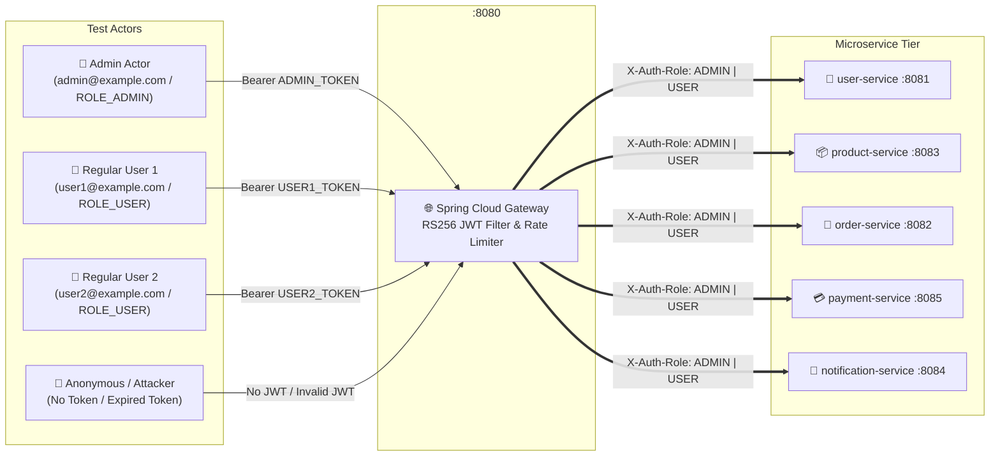
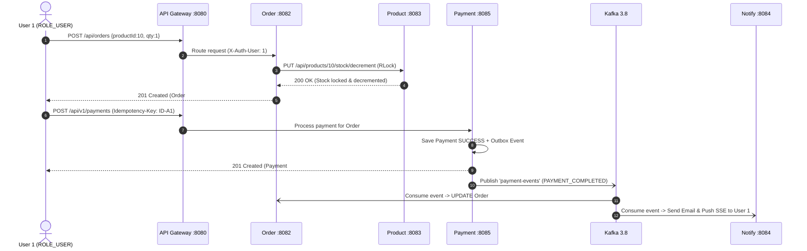

# 🧪 Full-Stack Microservices — Role-Based Access Control (RBAC) & Integration Test Specification

This document provides a comprehensive, production-grade integration test specification for the Java 21 / Spring Boot 3.3 Microservices Full-Stack Project. It defines structured test scenarios for both **Admin** (`ROLE_ADMIN`) and **Regular User** (`ROLE_USER`) roles across all microservices, validating role-based access control (RBAC), tenant isolation, idempotency, distributed transactions (Sagas), and end-to-end multi-service workflows.

---

## 📋 Table of Contents
1. [Test Environment & Role Setup Architecture](#1-test-environment--role-setup-architecture)
2. [Security & Header Propagation Test Matrix](#2-security--header-propagation-test-matrix)
3. [Module 1: User Service (`user-service :8081`)](#3-module-1-user-service-user-service-8081)
4. [Module 2: Product Service (`product-service :8083`)](#4-module-2-product-service-product-service-8083)
5. [Module 3: Order Service & BFF Aggregator (`order-service :8082`)](#5-module-3-order-service--bff-aggregator-order-service-8082)
6. [Module 4: Payment Service (`payment-service :8085`)](#6-module-4-payment-service-payment-service-8085)
7. [Module 5: Notification Service (`notification-service :8084`)](#7-module-5-notification-service-notification-service-8084)
8. [End-to-End Role-Based Multi-Service Workflows](#8-end-to-end-role-based-multi-service-workflows)
9. [Automated Integration Testing Framework Implementation Guide](#9-automated-integration-testing-framework-implementation-guide)

---

## 1. Test Environment & Role Setup Architecture

### 1.1 Test Actors & Seeding
All tests execute against the Spring Cloud API Gateway (`http://localhost:8080`), which intercepts requests, validates RS256-signed JWTs, enforces rate limits, and propagates trusted headers (`X-Auth-User`, `X-Auth-Role`) to downstream bounded contexts.



### 1.2 Authentication Pre-Test Hook (Setup Step)
Before executing integration tests, the automated test harness executes the following setup steps to acquire authentication tokens:

```http
# 1. Acquire Admin Token
POST http://localhost:8080/api/auth/login
Content-Type: application/json

{
  "email": "admin@example.com",
  "password": "AdminPassword123!"
}
# Response: 200 OK -> Save data.accessToken as {{ADMIN_TOKEN}}

# 2. Acquire User 1 Token
POST http://localhost:8080/api/auth/login
Content-Type: application/json

{
  "email": "user1@example.com",
  "password": "UserPassword123!"
}
# Response: 200 OK -> Save data.accessToken as {{USER1_TOKEN}}

# 3. Acquire User 2 Token (for Cross-Tenant Security Isolation Tests)
POST http://localhost:8080/api/auth/login
Content-Type: application/json

{
  "email": "user2@example.com",
  "password": "UserPassword123!"
}
# Response: 200 OK -> Save data.accessToken as {{USER2_TOKEN}}
```

---

## 2. Security & Header Propagation Test Matrix

This matrix validates that the API Gateway correctly enforces JWT signatures, rejects forged tokens, and injects trusted identity headers into internal microservice requests.

| Test ID | Scenario Description | Actor Role | Request Target | Headers / Payload | Expected HTTP Status | Expected Response / System Behavior |
| :--- | :--- | :---: | :--- | :--- | :---: | :--- |
| **TC-SEC-01** | Unauthenticated request to protected route | `ANON` | `GET /api/orders/user/1` | No `Authorization` header | `401 Unauthorized` | Gateway rejects request; request never reaches `order-service`. |
| **TC-SEC-02** | Expired or tampered JWT signature | `ANON` | `GET /api/orders/user/1` | `Authorization: Bearer <tampered_token>` | `401 Unauthorized` | RS256 signature verification fails at Gateway filter. |
| **TC-SEC-03** | Attempted header forgery via direct client injection | `USER1` | `GET /api/users/2` | `Authorization: Bearer {{USER1_TOKEN}}`<br/>`X-Auth-Role: ADMIN` | `403 Forbidden` | Gateway overwrites/strips forged `X-Auth-Role` header with verified JWT claim (`ROLE_USER`). |
| **TC-SEC-04** | Rate limiter bucket exhaustion | `ANON` | `POST /api/auth/login` (60x in 1s) | Valid login credentials | `429 Too Many Requests` | Redis token bucket rate limiter throttles excessive bursts. |

---

## 3. Module 1: User Service (`user-service :8081`)

### 3.1 Admin Role Scenarios (`ROLE_ADMIN`)
Admin users have global read/write permissions across all user profiles and administrative directories.

```markdown
#### [TC-USER-ADMIN-01] Admin Retrieves Any User Profile by ID
- **Precondition**: Logged in as `ADMIN` (`{{ADMIN_TOKEN}}`).
- **Action**: `GET /api/users/{user1_id}`
- **Headers**: `Authorization: Bearer {{ADMIN_TOKEN}}`
- **Expected Status**: `200 OK`
- **Expected Body**:
  ```json
  {
    "success": true,
    "data": {
      "id": 1,
      "email": "user1@example.com",
      "fullName": "User One",
      "role": "USER",
      "status": "ACTIVE"
    }
  }
  ```

#### [TC-USER-ADMIN-02] Admin Accesses Admin Directory Query Route
- **Precondition**: Logged in as `ADMIN` (`{{ADMIN_TOKEN}}`).
- **Action**: `GET /api/admin/users?page=0&size=20`
- **Headers**: `Authorization: Bearer {{ADMIN_TOKEN}}`
- **Expected Status**: `200 OK`
- **Expected Body**: Paginated list of all registered users in the database (`totalElements >= 3`).

#### [TC-USER-ADMIN-03] Admin Modifies Any User's Account Status or Profile
- **Precondition**: Logged in as `ADMIN` (`{{ADMIN_TOKEN}}`).
- **Action**: `PUT /api/users/{user1_id}`
- **Headers**: `Authorization: Bearer {{ADMIN_TOKEN}}`
- **Payload**: `{"fullName": "User One Updated", "status": "ACTIVE"}`
- **Expected Status**: `200 OK`
- **Database Verification**: `users` table row `id = {user1_id}` reflects `full_name = 'User One Updated'`.
```

### 3.2 Regular User Role Scenarios (`ROLE_USER`)
Regular users can only view and edit their own profile; access to other users' data or `/api/admin/**` endpoints must be blocked.

```markdown
#### [TC-USER-USER-01] User Retrieves Their Own Profile
- **Precondition**: Logged in as `USER1` (`{{USER1_TOKEN}}`, ID = 1).
- **Action**: `GET /api/users/1`
- **Headers**: `Authorization: Bearer {{USER1_TOKEN}}`
- **Expected Status**: `200 OK`
- **Expected Body**: Profile matches `user1@example.com`.

#### [TC-USER-USER-02] User Attempts to View Another User's Profile (Tenant Isolation)
- **Precondition**: Logged in as `USER1` (`{{USER1_TOKEN}}`, ID = 1).
- **Action**: `GET /api/users/2` (Targeting User 2)
- **Headers**: `Authorization: Bearer {{USER1_TOKEN}}`
- **Expected Status**: `403 Forbidden`
- **Expected Body**:
  ```json
  {
    "success": false,
    "error": {
      "code": "ACCESS_DENIED",
      "message": "Access Denied: Cannot access another user's resource"
    }
  }
  ```

#### [TC-USER-USER-03] User Attempts to Access Admin-Only Route
- **Precondition**: Logged in as `USER1` (`{{USER1_TOKEN}}`).
- **Action**: `GET /api/admin/users`
- **Headers**: `Authorization: Bearer {{USER1_TOKEN}}`
- **Expected Status**: `403 Forbidden`
```

---

## 4. Module 2: Product Service (`product-service :8083`)

### 4.1 Admin Role Scenarios (`ROLE_ADMIN` Catalog Management)
Only Admin users can mutate catalog items, update stock levels, and generate S3 presigned upload URLs.

```markdown
#### [TC-PROD-ADMIN-01] Admin Creates a New Product SKU
- **Precondition**: Logged in as `ADMIN` (`{{ADMIN_TOKEN}}`).
- **Action**: `POST /api/products`
- **Headers**:
  - `Authorization: Bearer {{ADMIN_TOKEN}}`
  - `Content-Type: application/json`
- **Payload**:
  ```json
  {
    "name": "Wireless Ultra Headphones",
    "description": "Noise-cancelling bluetooth headphones",
    "price": 199.99,
    "stockQuantity": 50,
    "category": "Electronics",
    "imageUrl": "https://s3.amazonaws.com/demo/headphones.jpg"
  }
  ```
- **Expected Status**: `201 Created`
- **Cache Verification**: Subsequent `GET /api/products?category=Electronics` returns the new SKU from Redis cache.

#### [TC-PROD-ADMIN-02] Admin Updates Product Stock & Price
- **Precondition**: Logged in as `ADMIN` (`{{ADMIN_TOKEN}}`).
- **Action**: `PUT /api/products/{sku_id}`
- **Payload**: `{"price": 179.99, "stockQuantity": 75}`
- **Expected Status**: `200 OK`
- **Lock & Cache Verification**: Verifies Redisson distributed lock `lock:product:{sku_id}` is acquired and released safely, and Redis cache entry `@Cacheable` is evicted/updated.

#### [TC-PROD-ADMIN-03] Admin Deletes a Product SKU
- **Precondition**: Logged in as `ADMIN` (`{{ADMIN_TOKEN}}`).
- **Action**: `DELETE /api/products/{sku_id}`
- **Expected Status**: `204 No Content`
```

### 4.2 Regular User Role Scenarios (`ROLE_USER` Read-Only Access)

```markdown
#### [TC-PROD-USER-01] User Retrieves Paginated Catalog
- **Precondition**: Logged in as `USER1` (`{{USER1_TOKEN}}`).
- **Action**: `GET /api/products?page=0&size=10`
- **Expected Status**: `200 OK`
- **Expected Body**: `content` array with SKUs, `pageable` metadata.

#### [TC-PROD-USER-02] User Attempts Unauthorized Product Creation
- **Precondition**: Logged in as `USER1` (`{{USER1_TOKEN}}`).
- **Action**: `POST /api/products`
- **Payload**: Valid product JSON.
- **Expected Status**: `403 Forbidden`
- **System Verification**: Catalog row count remains unchanged.

#### [TC-PROD-USER-03] User Attempts Unauthorized Stock Decrement API Call
- **Precondition**: Logged in as `USER1` (`{{USER1_TOKEN}}`).
- **Action**: `PUT /api/products/{sku_id}/stock/decrement?qty=1` (Direct manual call)
- **Expected Status**: `403 Forbidden` (Stock decrementing is strictly reserved for internal `order-service` calls or Admin overrides).
```

---

## 5. Module 3: Order Service & BFF Aggregator (`order-service :8082`)

### 5.1 Admin Role Scenarios (`ROLE_ADMIN` Global Order Management)

```markdown
#### [TC-ORD-ADMIN-01] Admin Retrieves Any User's Orders
- **Precondition**: Logged in as `ADMIN` (`{{ADMIN_TOKEN}}`).
- **Action**: `GET /api/orders/user/{user1_id}`
- **Expected Status**: `200 OK`
- **Expected Body**: Returns all orders belonging to `user1_id`.

#### [TC-ORD-ADMIN-02] Admin Overrides / Cancels Order Status
- **Precondition**: Logged in as `ADMIN` (`{{ADMIN_TOKEN}}`).
- **Action**: `PUT /api/orders/{order_id}/status?status=CANCELLED`
- **Expected Status**: `200 OK`
- **Event Verification**: Outbox table `outbox_events` logs `ORDER_CANCELLED_EVENT`; Kafka topic `order-events` receives cancellation record.
```

### 5.2 Regular User Role Scenarios (`ROLE_USER` Checkout & BFF Aggregator)

```markdown
#### [TC-ORD-USER-01] User Places a New Order (Saga Pattern Initiation)
- **Precondition**: Logged in as `USER1` (`{{USER1_TOKEN}}`, ID = 1), Product ID 10 has stock = 50.
- **Action**: `POST /api/orders`
- **Payload**:
  ```json
  {
    "userId": 1,
    "productId": 10,
    "quantity": 2,
    "totalPrice": 399.98
  }
  ```
- **Expected Status**: `201 Created`
- **Expected Body**: `{"id": 100, "status": "PENDING", ...}`
- **Distributed System State**:
  1. `order-service` PostgreSQL: Order #100 inserted with status `PENDING`.
  2. `product-service`: Product ID 10 stock decremented from `50` -> `48`.
  3. `outbox_events` table: Event created for background virtual thread relay.

#### [TC-ORD-USER-02] User Queries Aggregated BFF Order Details
- **Precondition**: Order #100 belongs to `USER1`.
- **Action**: `GET /api/v1/aggregator/order-details/100`
- **Headers**: `Authorization: Bearer {{USER1_TOKEN}}`
- **Expected Status**: `200 OK`
- **Expected Body**:
  ```json
  {
    "success": true,
    "data": {
      "orderId": 100,
      "orderStatus": "PENDING",
      "user": {
        "id": 1,
        "fullName": "User One",
        "email": "user1@example.com"
      },
      "product": {
        "id": 10,
        "name": "Wireless Ultra Headphones",
        "price": 199.99
      },
      "payments": []
    }
  }
  ```

#### [TC-ORD-USER-03] User Attempts to Query Another User's Order via BFF
- **Precondition**: Order #101 belongs to `USER2`.
- **Action**: `GET /api/v1/aggregator/order-details/101`
- **Headers**: `Authorization: Bearer {{USER1_TOKEN}}`
- **Expected Status**: `403 Forbidden` / `404 Not Found` (Tenant security boundary prevents cross-user order disclosure).
```

---

## 6. Module 4: Payment Service (`payment-service :8085`)

### 6.1 Admin Role Scenarios (`ROLE_ADMIN` Financial Auditing & Refunds)

```markdown
#### [TC-PAY-ADMIN-01] Admin Audits All Payment Transactions for an Order
- **Precondition**: Logged in as `ADMIN` (`{{ADMIN_TOKEN}}`).
- **Action**: `GET /api/v1/payments/order/100`
- **Expected Status**: `200 OK`
- **Expected Body**: Array of all payment attempts (`CREDIT_CARD`, `UPI`, etc.) associated with Order #100.

#### [TC-PAY-ADMIN-02] Admin Initiates Payment Refund
- **Precondition**: Logged in as `ADMIN` (`{{ADMIN_TOKEN}}`), Payment ID 500 is in `SUCCESS` state.
- **Action**: `POST /api/v1/payments/500/refund`
- **Payload**:
  ```json
  {
    "reason": "Customer cancellation request",
    "amount": 99.99
  }
  ```
- **Expected Status**: `200 OK`
- **Database & Kafka State**:
  - Payment record status updated to `REFUNDED`.
  - Outbox event `PAYMENT_REFUNDED_EVENT` produced to Kafka topic `payment-events`.
```

### 6.2 Regular User Role Scenarios (`ROLE_USER` Tokenized Checkout & Idempotency)

```markdown
#### [TC-PAY-USER-01] User Retrieves PCI-DSS Merchant RSA-2048 Public Key
- **Precondition**: Logged in as `USER1` (`{{USER1_TOKEN}}`).
- **Action**: `GET /api/v1/payments/security/public-key`
- **Expected Status**: `200 OK`
- **Expected Body**: Valid X.509 PEM-encoded public key (`-----BEGIN PUBLIC KEY-----...`).

#### [TC-PAY-USER-02] User Submits Payment with Idempotency Key
- **Precondition**: Order #100 is in `PENDING` state.
- **Action**: `POST /api/v1/payments`
- **Headers**:
  - `Authorization: Bearer {{USER1_TOKEN}}`
  - `X-Idempotency-Key: IDEM-TEST-2026-001`
  - `Content-Type: application/json`
- **Payload**:
  ```json
  {
    "orderId": 100,
    "userId": 1,
    "amount": 399.98,
    "currency": "USD",
    "paymentMethod": "CREDIT_CARD",
    "idempotencyKey": "IDEM-TEST-2026-001",
    "cardLast4": "4242",
    "cardBrand": "VISA",
    "gatewayProvider": "STRIPE_SIMULATOR"
  }
  ```
- **Expected Status**: `201 Created`
- **Expected Body**:
  ```json
  {
    "success": true,
    "data": {
      "id": 500,
      "status": "SUCCESS",
      "transactionReference": "CARD-TX-792837482"
    }
  }
  ```

#### [TC-PAY-USER-03] Idempotency Guard Verification (Duplicate Request Replay)
- **Precondition**: `TC-PAY-USER-02` completed successfully.
- **Action**: Re-send identical `POST /api/v1/payments` request with header `X-Idempotency-Key: IDEM-TEST-2026-001`.
- **Expected Status**: `200 OK` (Returned from Redis/DB cache without creating a new payment record or debiting the card a second time).
- **System Verification**: Database count of payment transactions remains `1`; `transactionReference` matches original ID `500`.

#### [TC-PAY-USER-04] User Attempts to Issue Refund on Another User's Order
- **Precondition**: Logged in as `USER1`, targeting Payment ID 501 belonging to `USER2`.
- **Action**: `POST /api/v1/payments/501/refund`
- **Payload**: `{"reason": "Attacker refund attempt", "amount": 10.00}`
- **Expected Status**: `403 Forbidden`
```

---

## 7. Module 5: Notification Service (`notification-service :8084`)

### 7.1 Admin & User Notification Flow Verification

```markdown
#### [TC-NOTIF-ADMIN-01] Admin Audits System Notification History
- **Precondition**: Logged in as `ADMIN` (`{{ADMIN_TOKEN}}`).
- **Action**: `GET /api/notifications/user/1`
- **Expected Status**: `200 OK`
- **Expected Body**: Array of SMS/Email confirmation logs generated by Kafka event processing.

#### [TC-NOTIF-USER-01] User Subscribes to Real-Time SSE Notification Stream
- **Precondition**: Logged in as `USER1` (`{{USER1_TOKEN}}`).
- **Action**: `GET /api/sse/notifications?userId=1`
- **Headers**: `Accept: text/event-stream`
- **Expected Status**: `200 OK` (`Transfer-Encoding: chunked`, continuous SSE connection established).
- **Stream Verification**: When Order #100 transitions from `PENDING` -> `CONFIRMED`, an SSE event packet (`data: {"type": "ORDER_CONFIRMED", ...}`) is pushed down the open TCP stream.
```

---

## 8. End-to-End Role-Based Multi-Service Workflows

### 8.1 E2E Scenario A: Happy-Path User Checkout & Order Confirmation Saga
This test validates the entire distributed saga choreography across 5 microservices when a regular user makes a purchase.



1. **Step 1 (Order Service)**: User 1 calls `POST /api/orders` -> receives `201 Created` (`Order #100`, status `PENDING`).
2. **Step 2 (Product Service)**: Verify SKU #10 stock reduced in database (`50` -> `49`).
3. **Step 3 (Payment Service)**: User 1 calls `POST /api/v1/payments` with `X-Idempotency-Key: E2E-SAGA-01` -> receives `201 Created` (`status: SUCCESS`).
4. **Step 4 (Kafka Choreography)**:
   - Poll `order-service` database until Order #100 status transitions from `PENDING` -> `CONFIRMED` (processed via Kafka outbox listener).
5. **Step 5 (Notification Service)**:
   - Call `GET /api/notifications/user/1` -> verify new notification record exists with title `"Order Confirmed - #100"`.
6. **Step 6 (BFF Aggregator)**:
   - Call `GET /api/v1/aggregator/order-details/100` -> verify composite response contains `"orderStatus": "CONFIRMED"` and matching `"payments"` array.

---

### 8.2 E2E Scenario B: Admin Catalog Restock & Order Override Workflow
This test validates administrative governance and intervention across bounded contexts.

1. **Step 1 (Admin Catalog Update)**: Admin logs in (`{{ADMIN_TOKEN}}`), calls `PUT /api/products/10` to restock SKU #10 (`stockQuantity: 500`).
2. **Step 2 (Catalog Verification)**: User 1 calls `GET /api/products/10` -> verifies price and stock level reflect Admin's update immediately.
3. **Step 3 (Admin Order Intervention)**: Admin inspects User 1's order history via `GET /api/orders/user/1`.
4. **Step 4 (Admin Status Override)**: Admin calls `PUT /api/orders/100/status?status=CANCELLED` -> verifies order transitions to `CANCELLED` and cancellation notice is dispatched via `notification-service`.

---

### 8.3 E2E Scenario C: Negative Security & Privilege Escalation Attempt (RBAC Audit)
This test validates that regular users cannot elevate privileges or access cross-tenant data.

```markdown
1. **Attempt 1 (Admin Route Access)**:
   - `USER1` calls `GET /api/admin/users` -> Assert `HTTP 403 Forbidden`.
2. **Attempt 2 (Cross-Tenant Order Reading)**:
   - `USER1` calls `GET /api/orders/{user2_order_id}` -> Assert `HTTP 403 Forbidden` / `404 Not Found`.
3. **Attempt 3 (Cross-Tenant Refund Execution)**:
   - `USER1` calls `POST /api/v1/payments/{user2_payment_id}/refund` -> Assert `HTTP 403 Forbidden`.
4. **Attempt 4 (Header Spoofing Attack)**:
   - `USER1` sends request `GET /api/users/2` with forged headers `X-Auth-Role: ADMIN` and `X-Auth-User: 1`.
   - Assert `HTTP 403 Forbidden` (Gateway strips client headers and replaces them with cryptographically verified JWT claims).
```

---

## 9. Automated Integration Testing Framework Implementation Guide

To implement these test scenarios inside an automated CI/CD pipeline, use **Testcontainers**, **REST-assured**, and **JUnit 5**.

### 9.1 Test Harness Template (`RbacIntegrationTest.java`)

```java
package com.demo.integration;

import io.restassured.RestAssured;
import io.restassured.http.ContentType;
import io.restassured.response.Response;
import org.junit.jupiter.api.*;
import org.springframework.boot.test.context.SpringBootTest;
import org.springframework.boot.test.web.server.LocalServerPort;
import org.springframework.test.context.DynamicPropertyRegistry;
import org.springframework.test.context.DynamicPropertySource;
import org.testcontainers.containers.PostgreSQLContainer;
import org.testcontainers.junit.jupiter.Container;
import org.testcontainers.junit.jupiter.Testcontainers;

import static io.restassured.RestAssured.given;
import static org.hamcrest.Matchers.*;

@SpringBootTest(webEnvironment = SpringBootTest.WebEnvironment.RANDOM_PORT)
@Testcontainers
@TestMethodOrder(MethodOrderer.OrderAnnotation.class)
public class RbacIntegrationTest {

    @LocalServerPort
    private int port;

    @Container
    static PostgreSQLContainer<?> postgres = new PostgreSQLContainer<>("postgres:16-alpine")
            .withDatabaseName("engine_test")
            .withUsername("postgres")
            .withPassword("postgres");

    private static String adminToken;
    private static String user1Token;

    @DynamicPropertySource
    static void overrideProperties(DynamicPropertyRegistry registry) {
        registry.add("spring.datasource.url", postgres::getJdbcUrl);
        registry.add("spring.datasource.username", postgres::getUsername);
        registry.add("spring.datasource.password", postgres::getPassword);
    }

    @BeforeEach
    void setUp() {
        RestAssured.port = port;
        if (adminToken == null) {
            adminToken = acquireToken("admin@example.com", "AdminPassword123!");
            user1Token = acquireToken("user1@example.com", "UserPassword123!");
        }
    }

    private String acquireToken(String email, String password) {
        return given()
                .contentType(ContentType.JSON)
                .body(String.format("{\"email\":\"%s\",\"password\":\"%s\"}", email, password))
                .when()
                .post("/api/auth/login")
                .then()
                .statusCode(200)
                .extract()
                .path("data.accessToken");
    }

    // ── RBAC Module 1: User Service Tests ─────────────────────────────────

    @Test
    @Order(1)
    @DisplayName("TC-USER-ADMIN-01: Admin can access any user profile")
    void adminCanAccessAnyUserProfile() {
        given()
                .header("Authorization", "Bearer " + adminToken)
                .when()
                .get("/api/users/1")
                .then()
                .statusCode(200)
                .body("success", is(true))
                .body("data.id", equalTo(1));
    }

    @Test
    @Order(2)
    @DisplayName("TC-USER-USER-02: Regular user cannot access another user's profile")
    void userCannotAccessOtherUserProfile() {
        given()
                .header("Authorization", "Bearer " + user1Token)
                .when()
                .get("/api/users/2")
                .then()
                .statusCode(403);
    }

    // ── RBAC Module 2: Product Service Tests ──────────────────────────────

    @Test
    @Order(3)
    @DisplayName("TC-PROD-ADMIN-01: Admin can create new SKU")
    void adminCanCreateProduct() {
        String skuJson = """
                {
                  "name": "E2E Test Laptop",
                  "description": "High-performance testing laptop",
                  "price": 1499.00,
                  "stockQuantity": 15,
                  "category": "Electronics"
                }
                """;

        given()
                .header("Authorization", "Bearer " + adminToken)
                .contentType(ContentType.JSON)
                .body(skuJson)
                .when()
                .post("/api/products")
                .then()
                .statusCode(201)
                .body("data.name", equalTo("E2E Test Laptop"));
    }

    @Test
    @Order(4)
    @DisplayName("TC-PROD-USER-02: Regular user cannot create SKU")
    void userCannotCreateProduct() {
        given()
                .header("Authorization", "Bearer " + user1Token)
                .contentType(ContentType.JSON)
                .body("{\"name\":\"Unauthorized SKU\",\"price\":10.00,\"stockQuantity\":1}")
                .when()
                .post("/api/products")
                .then()
                .statusCode(403);
    }

    // ── Idempotency & E2E Checkout Flow Tests ─────────────────────────────

    @Test
    @Order(5)
    @DisplayName("TC-PAY-USER-03: Idempotency Key prevents duplicate card charges")
    void testPaymentIdempotencyGuard() {
        String idempotencyKey = "IDEM-TEST-KEY-8888";
        String paymentPayload = """
                {
                  "orderId": 100,
                  "userId": 1,
                  "amount": 99.99,
                  "currency": "USD",
                  "paymentMethod": "CREDIT_CARD",
                  "idempotencyKey": "%s",
                  "cardLast4": "4242",
                  "cardBrand": "VISA",
                  "gatewayProvider": "STRIPE_SIMULATOR"
                }
                """.formatted(idempotencyKey);

        // First charge -> expect 201 Created
        int firstId = given()
                .header("Authorization", "Bearer " + user1Token)
                .header("X-Idempotency-Key", idempotencyKey)
                .contentType(ContentType.JSON)
                .body(paymentPayload)
                .when()
                .post("/api/v1/payments")
                .then()
                .statusCode(201)
                .body("data.status", equalTo("SUCCESS"))
                .extract()
                .path("data.id");

        // Duplicate charge replay with same key -> expect 200 OK (returned from cache)
        int secondId = given()
                .header("Authorization", "Bearer " + user1Token)
                .header("X-Idempotency-Key", idempotencyKey)
                .contentType(ContentType.JSON)
                .body(paymentPayload)
                .when()
                .post("/api/v1/payments")
                .then()
                .statusCode(200)
                .body("data.id", equalTo(firstId));
    }
}
```

---

## 10. Verification Checklist for CI/CD Pipelines
When integrating this test suite into Github Actions or Jenkins, ensure the following assertions pass before promoting builds:
- [x] All unauthenticated requests to protected endpoints return `HTTP 401 Unauthorized`.
- [x] All requests by `ROLE_USER` to `/api/admin/**` or cross-tenant resources return `HTTP 403 Forbidden`.
- [x] All requests by `ROLE_ADMIN` successfully mutate product catalogs, override order states, and issue refunds (`HTTP 200/201`).
- [x] Replaying a payment request with an existing `X-Idempotency-Key` returns `HTTP 200 OK` without creating duplicate database rows.
- [x] Saga outbox events (`ORDER_CREATED_EVENT`, `PAYMENT_COMPLETED_EVENT`) produce exactly-once Kafka messages and transition Order #100 to `CONFIRMED`.
