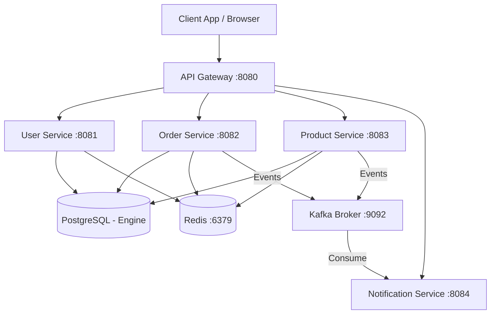

# System Design & Architecture

## High-Level Architecture

The system follows a classic microservices architecture centered around an API Gateway, an event bus (Kafka), and a shared data caching layer (Redis). Service discovery is handled natively by Kubernetes.

## Key Architectural Decisions

1. **Service Discovery**: Removed Eureka in favor of Kubernetes-native DNS routing. Services communicate via direct URLs (e.g., `http://order-service:8082`).
2. **Concurrency**: Utilizes **Java 21 Virtual Threads** (`spring.threads.virtual.enabled=true`) for non-blocking parallel execution (e.g., in `OrderService`).
3. **Data Caching & Locking**: 
   - Uses Spring's `@Cacheable` abstraction with Redis for read-heavy operations.
   - Uses **Redisson** (`RLock`, `RBucket`) for distributed inventory management and concurrency control.
4. **Audit Logging**: A shared `common-module` implements an AOP-based `@Around` aspect to intercept and asynchronously log all controller actions to a centralized `audit_logs` table.
5. **Real-time Notifications**: Implemented via Spring WebFlux Server-Sent Events (SSE) and Reactor Sinks.
6. **Authentication**: 
   - Gateway enforces JWT validation.
   - Dual-profile support allows switching between lightweight local JWTs or a full **OAuth2/Keycloak** Resource Server topology.

## Distributed Tracing & Resilience

- **Resilience4j** is configured on the API Gateway to provide Circuit Breaking and Rate Limiting (via Redis) to protect downstream services.
