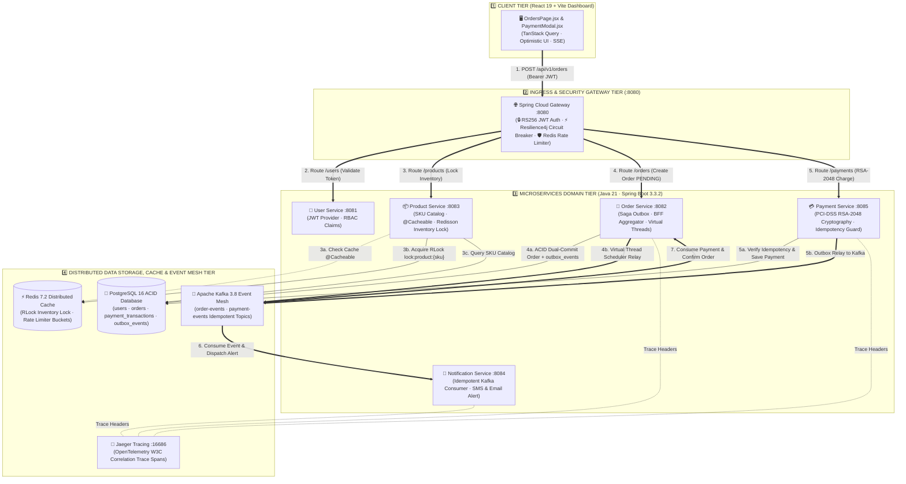
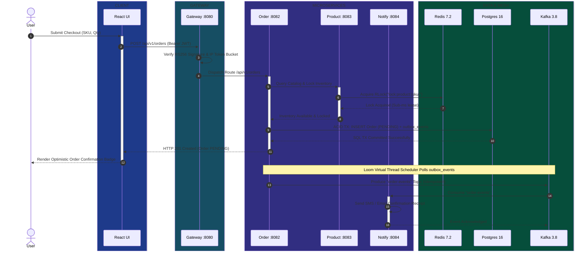
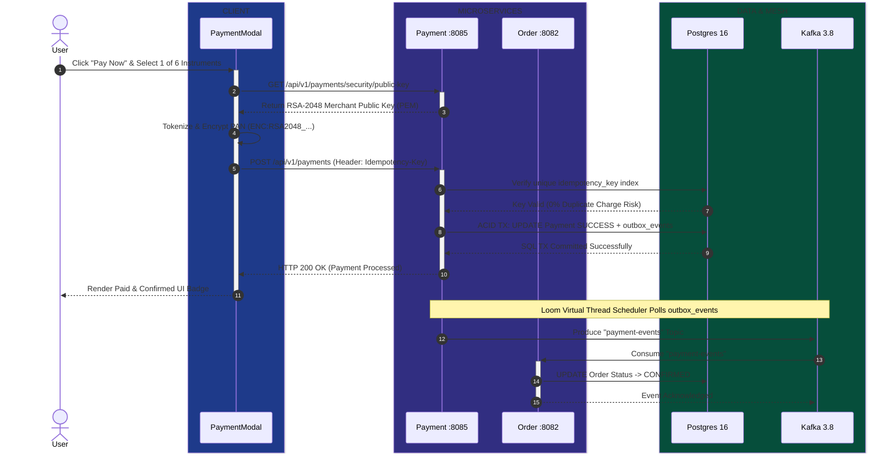

# System Design & Architecture

## High-Level Architecture

The system follows a classic microservices architecture centered around an API Gateway, an event bus (Kafka), and a shared data caching layer (Redis). Service discovery is handled natively by Kubernetes.

### 1. Secure Order Creation & Saga Choreography Sequence

### 2. PCI-DSS RSA-2048 Secure Payment Tokenization Sequence

## Architectural Trade-off Evaluation Table

| Architectural Decision | Chosen Pattern | Rejected Alternative | Technical Justification & Trade-off |
| :--- | :--- | :--- | :--- |
| **Distributed Transactions** | **Choreography Saga + ACID Outbox** | **2-Phase Commit (2PC) / XA** | Avoids global locking and synchronous blocking across services. Outbox guarantees at-least-once delivery without distributed deadlocks. |
| **Concurrency Engine** | **Java 21 Virtual Threads (Loom)** | **Reactive Programming (WebFlux/RxJava)** | Retains clean imperative code without thread-pool exhaustion or Callback Hell. |
| **Inventory Locking** | **Redisson Distributed Lock (`RLock`)** | **PostgreSQL `SELECT FOR UPDATE`** | Offloads locking contention from the primary ACID database to sub-millisecond Redis RAM. |
| **API Gateway Security** | **RS256 Asymmetric JWT Validation** | **Introspection Endpoint / Session DB** | Zero-latency, stateless token validation at the edge without querying Identity Provider per request. |
| **Payment Security** | **Client-Side RSA-2048 Tokenization** | **Direct Raw PAN Transmission** | Keeps backend services out of PCI-DSS scope by encrypting cards in the browser before network transit. |

## UI Architecture Visualization
The React frontend includes a **Dynamic Architecture Diagram** built directly into the Login Dashboard using native HTML/CSS (no external charting libraries). It dynamically visualizes the connection between the React Client, API Gateway, Microservices, and the Infrastructure layer (Postgres, Redis, Kafka, Keycloak), complete with animated data packet flows.

## Key Architectural Decisions

1. **Service Discovery**: Removed Eureka in favor of Kubernetes-native DNS routing. Services communicate via direct URLs (e.g., `http://order-service:8082`).
2. **Concurrency**: Utilizes **Java 21 Virtual Threads** (`spring.threads.virtual.enabled=true`) for non-blocking parallel execution across all services.
3. **PCI-DSS Compliant Payment Cryptography & Security**:
   - `payment-service` implements **RSA-2048 Asymmetric Public / Private Key Cryptography** (`PaymentCryptographyService`) for client-side card tokenization and SHA256withRSA signature verification.
   - Leverages **Java 21 Sealed Interfaces** (`PaymentInstrument`, `GatewayExecutionResult`) for exhaustive pattern matching switch across 22 global payment methods.
   - Enforces strict **Idempotency Protection** (`idempotency_key`) and the **Transactional Outbox Pattern** (`payment_outbox_events`).
4. **Data Caching & Locking**: 
   - Uses Spring's `@Cacheable` abstraction with Redis for read-heavy operations.
   - Uses **Redisson** (`RLock`, `RBucket`) for distributed inventory management and concurrency control.
5. **Audit Logging**: A shared `common-module` implements an AOP-based `@Around` aspect to intercept and asynchronously log all controller actions to a centralized `audit_logs` table, while `payment-service` maintains immutable financial audit records in `payment_audit_logs`.
6. **Real-time Notifications**: Implemented via Spring WebFlux Server-Sent Events (SSE) and Reactor Sinks.
7. **Authentication**: 
   - Gateway enforces JWT validation.
   - Dual-profile support allows switching between lightweight local JWTs or a full **OAuth2/Keycloak** Resource Server topology.

## Distributed Tracing & Resilience

- **Resilience4j** is configured on the API Gateway to provide Circuit Breaking and Rate Limiting (via Redis) to protect downstream services.

## Final Development Milestones & Polish
During the final phases of project development, several critical enterprise features and stability improvements were added:
1. **Frontend Global Error Handling**: Axios interceptors were implemented to detect service unavailability (503/504) and automatically log users out safely, preventing the app from hanging.
2. **Aggregator Pattern Stabilization**: The `order-service` implements an API Aggregator that merges Order and Product data. This was fortified to gracefully handle errors from the `product-service` without crashing the page, correctly falling back to generic data when necessary.
3. **CORS & Preflight Integrity**: Gateway CORS configurations were strict-tuned to properly forward preflight `OPTIONS` requests and required headers (`Authorization`, `Content-Type`) preventing modern browsers from blocking legitimate cross-origin XHR requests.
4. **Cache Type Serialization**: Redis caching (`@Cacheable`) was upgraded to properly serialize/deserialize Java Object types by writing `@class` property metadata. This ensures complex polymorphic types like `OrderResponse` or `ProductResponse` can be safely fetched from the cache without `InvalidTypeIdException`.
5. **Local Developer Experience (DX)**: A suite of PowerShell orchestration scripts (`start-all.ps1`, `start-down.ps1`, `stop-all.ps1`) was introduced to dramatically speed up the local Windows development lifecycle.
