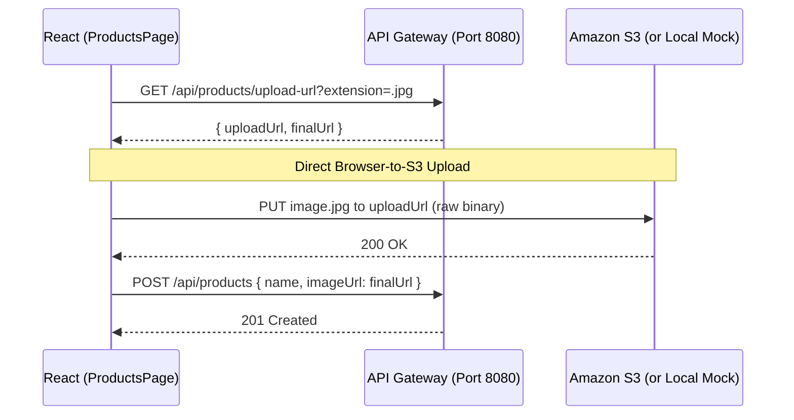
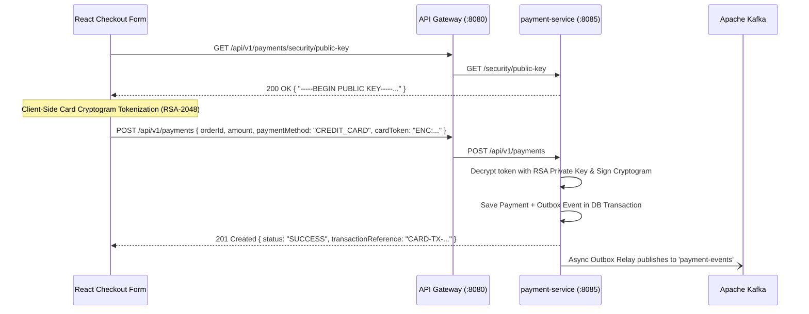

# Microservices Full-Stack Frontend

This is the React frontend application for the Java 21 Spring Boot Microservices project. It is built to be fast, scalable, and resilient, consuming the backend APIs securely via the Spring Cloud Gateway.

---

## 🛠️ Technologies Used

| Category | Technology | Purpose |
|----------|------------|---------|
| **Core** | **React 18** + **Vite 5** | Lightning-fast HMR, optimized production builds, concurrent rendering. |
| **Routing** | **React Router v6** | Client-side routing with protected routes and dynamic parameter extraction. |
| **State & Caching** | **TanStack Query v5** | Server-state management, automatic caching, background fetching, and deduplication of API requests. |
| **Forms** | **React Hook Form** | Performant, flexible, and extensible form validation without excessive re-renders. |
| **HTTP Client** | **Axios** | API communication with robust interceptors for JWT token injection and error handling. |

---

## 🏗️ Architectural Patterns & Solutions

To ensure a seamless user experience and robust security, we implemented several key frontend patterns:

| Pattern / Concept | How it was achieved in this frontend |
|-------------------|--------------------------------------|
| **Stateless Auth** | `AuthContext` manages the JWT token locally (in `localStorage` or memory). All routes check this context to determine access. |
| **Secure API Calls** | An **Axios Interceptor** automatically intercepts outgoing requests and injects the `Authorization: Bearer <token>` header. |
| **Global Error Handling** | `errorHelper.js` maps network errors (`ERR_NETWORK`) and 5xx (`502`/`503`/`504`) status codes to clear, actionable fallback messages (e.g., `"Backend service is offline or unreachable"`). Preserves user sessions during service outages rather than logging out unexpectedly. |
| **Smart Caching** | **TanStack Query** caches API responses (like the Product Catalog). If a user navigates away and back, the data loads instantly from cache while re-fetching silently in the background. |
| **Protected Routes** | Custom `ProtectedRoute` wrapper components evaluate the user's authentication state and roles before rendering the requested page, redirecting to `/login` if unauthorized. |
| **Direct-to-Cloud Uploads** | Bypasses the backend for large file uploads by requesting an AWS S3 Presigned URL, then streaming the binary file directly to S3 via a pure `axios.put`. |

### S3 Direct Upload Architecture
To maintain maximum performance and follow enterprise best practices, the React frontend handles file uploads directly to AWS S3 (via a Presigned URL) rather than sending heavy image binaries through the Spring Boot API Gateway.



### PCI-DSS Compliant Payment Checkout Architecture (`payment-service`)
To ensure enterprise-grade PCI-DSS compliance and support 22 global payment instruments (`CREDIT_CARD`, `UPI`, `NET_BANKING`, `WALLET`, `BNPL`, `EMI`), the React frontend integrates with `payment-service` (:8085) via asymmetric RSA-2048 cryptography:


---

## 🎨 UI/UX & Responsive Design

This frontend places a high emphasis on a premium, polished user experience:
1. **Dynamic Architecture Diagram**: The Login Dashboard features a fully native, CSS-animated architecture diagram that maps out the microservices, gateway, and infrastructure layer (Postgres, Redis, Kafka, Keycloak). Data flows are visualized using keyframe animations on HTML nodes.
2. **Perfect Symmetry & Constraints**: The Login Dashboard guarantees perfect 50/50 horizontal symmetry. The branding panel and the login card are forced into identical geometric constraints (`480px` height, `440px` width) resulting in a perfectly balanced visual weight.
3. **Scroll-Free Compactness**: The UI is designed to naturally fit inside small viewport heights (like laptop screens) without generating messy scrollbars.
4. **Browser Zoom Scaling**: For extreme height constraints (under 550px), the application leverages CSS `@media` queries with the `zoom` property to natively recalculate and shrink the layout dimensions for Chrome, ensuring content never clips at the top or bottom boundaries.

---

## 📦 Project Structure

```
frontend/
├── package.json
├── vite.config.js
├── src/
│   ├── api/            ← Axios instances, interceptors, and API call definitions
│   ├── assets/         ← Static images, SVGs, global CSS
│   ├── components/     ← Reusable UI components (Buttons, Modals, Cards)
│   ├── context/        ← React Context providers (e.g., AuthContext)
│   ├── pages/          ← Top-level route components (Login, Dashboard, Products)
│   ├── utils/          ← Helper functions and formatters
│   ├── App.jsx         ← Root component, Route definitions, QueryClientProvider
│   └── main.jsx        ← DOM mounting and React StrictMode
```

---

## 🚀 Getting Started

### Prerequisites
- **Node.js** (v18 or higher recommended)
- **npm** (v9+)

### Installation & Running Locally

1. **Navigate to the frontend directory:**
   ```bash
   cd frontend
   ```

2. **Install dependencies:**
   ```bash
   npm install
   ```

3. **Start the Vite development server:**
   ```bash
   npm run dev
   ```

The application will be running locally at `http://localhost:3000`.

### ⚠️ Backend Dependency Warning
Because this frontend heavily relies on the microservices backend for authentication and data:
- Ensure the **API Gateway** is running on `localhost:8080`.
- Ensure the required microservices (`user-service`, `product-service`, etc.) are up and healthy.
- If the backend is down, the frontend automatically detects the failure and displays a prominent status banner (`🚨 All Microservices Offline — Run start-all.ps1`) without destroying your login session, providing clear, actionable fallback messaging.
