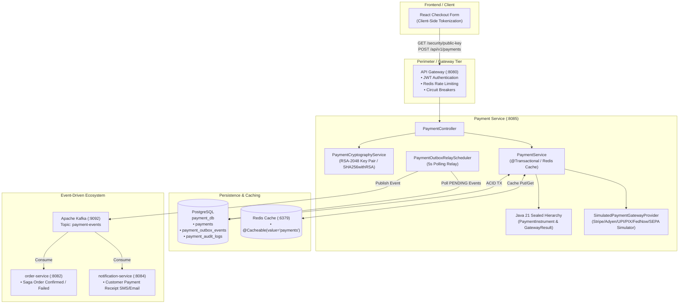
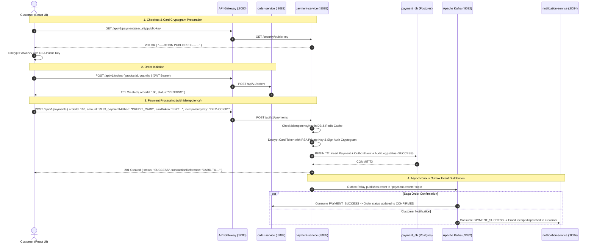

# Payment Service (`payment-service`) · Java 21 Spring Boot Microservice

An enterprise-grade, PCI-DSS and EMVCo compliant financial payment processing microservice built for the **Java 21 / Spring Boot 3.3.2 Full-Stack Microservices** workspace.

---

## 📑 Table of Contents
1. [Architectural Overview & Core Capabilities](#1-architectural-overview--core-capabilities)
2. [How It Works: End-to-End Microservices Interaction](#2-how-it-works-end-to-end-microservices-interaction)
3. [Internal Implementation & Design Patterns](#3-internal-implementation--design-patterns)
   - [RSA-2048 Asymmetric Cryptography & Tokenization](#31-rsa-2048-asymmetric-cryptography--tokenization)
   - [Java 21 Sealed Interfaces & Pattern Matching](#32-java-21-sealed-interfaces--pattern-matching)
   - [Idempotency & Transactional Outbox Relay](#33-idempotency--transactional-outbox-relay)
   - [Immutable Financial Audit Logging](#34-immutable-financial-audit-logging)
4. [Supported Global Payment Methods](#4-supported-global-payment-methods)
5. [Database Schema & Flyway Migrations](#5-database-schema--flyway-migrations)
6. [REST API Reference](#6-rest-api-reference)
7. [Testing & Verification](#7-testing--verification)

---

## 1. Architectural Overview & Core Capabilities

`payment-service` is an autonomous microservice responsible for orchestrating payments, refunds, and financial audit logs across the multi-module workspace. It runs on **Port 8085** and communicates synchronously via HTTP/REST (through the `api-gateway`) and asynchronously via **Apache Kafka KRaft** events (`payment-events` topic).



---

## 2. How It Works: End-to-End Microservices Interaction

`payment-service` is seamlessly integrated into the order lifecycle and microservice ecosystem:



### Key Ecosystem Interactions:
1. **API Gateway (`api-gateway` on port 8080)**:
   - Routes `/api/v1/payments/**` to `payment-service` (`http://localhost:8085`).
   - Enforces JWT authentication (`Bearer token`), Redis Rate Limiting, and Resilience4j Circuit Breakers (`paymentServiceBreaker`).
2. **Order Service (`order-service` on port 8082)**:
   - Initiates orders in `PENDING` state.
   - Listens to the `payment-events` Kafka topic. When a payment event with `status = SUCCESS` arrives, `order-service` updates the order state to `CONFIRMED`. If `status = FAILED`, it triggers compensating Saga actions (`CANCELLED`).
3. **Notification Service (`notification-service` on port 8084)**:
   - Consumes `payment-events` from Kafka and sends formatted HTML email receipts and SMS notifications to customers.

---

## 3. Internal Implementation & Design Patterns

### 3.1 RSA-2048 Asymmetric Cryptography & Tokenization
To meet PCI-DSS and EMVCo tokenization standards without exposing sensitive PAN/CVV data:
- **`PaymentCryptographyService`**: Generates an **RSA-2048** Key Pair on startup (`@PostConstruct`).
- **Client-Side Encryption**: Clients retrieve the PEM public key via `GET /api/v1/payments/security/public-key` and encrypt sensitive card data before transmission.
- **Server-Side Decryption & Signing**: The service decrypts incoming cryptograms using its RSA Private Key and generates a `SHA256withRSA` digital signature over the transaction reference to authenticate authorization payloads.

### 3.2 Java 21 Sealed Interfaces & Pattern Matching
The domain model uses Java 21's latest compiler features:
- **`PaymentInstrument` (Sealed Interface)**: Explicitly restricts implementations to 8 permitted records: `CardInstrument`, `UpiInstrument`, `NetBankingInstrument`, `WalletInstrument`, `BnplInstrument`, `DirectDebitMandateInstrument`, `EmiInstrument`, and `BankTransferInstrument`.
- **`GatewayExecutionResult` (Sealed Interface)**: Models gateway outcomes (`Success`, `Failure`, `PendingAction`).
- **Exhaustive `switch`**: Allows clean, pattern-matched dispatching in `SimulatedPaymentGatewayProvider.charge()` without needing error-prone default cases.

### 3.3 Idempotency & Transactional Outbox Relay
- **Idempotency Protection**: Every payment request requires a unique `idempotencyKey`. The `payments` database table has a `UNIQUE(idempotency_key)` index. If a network timeout causes a client retry with the same key, `PaymentService.processPayment()` returns the existing cached payment without recharging the card.
- **Transactional Outbox**: Rather than executing a distributed 2-Phase Commit (2PC) or sending a Kafka message inside an active DB transaction, `PaymentService` inserts a row into `payment_outbox_events` in the same ACID transaction as the `Payment` record.
- **`PaymentOutboxRelayScheduler`**: Runs every 5 seconds on virtual threads, polling for `PENDING` outbox records, publishing them to `payment-events` Kafka topic (`KafkaConstants.TOPIC_PAYMENT_EVENTS`), and marking them as `PROCESSED`.

### 3.4 Immutable Financial Audit Logging
Every state transition is recorded in the `payment_audit_logs` table (`PaymentAuditLog` JPA entity), capturing:
- Previous and new payment status (`PENDING` ➔ `SUCCESS`, `SUCCESS` ➔ `REFUNDED`).
- Reason codes, action timestamps, and actor references for compliance and financial reconciliation.

---

## 4. Supported Global Payment Methods

The `PaymentMethod` enum covers **22 global ISO 20022 and industry-standard payment instruments**:

| Scheme Category | Supported Enum Values | Industry Standards |
| :--- | :--- | :--- |
| **Credit / Debit Cards** | `CREDIT_CARD`, `DEBIT_CARD`, `PREPAID_CARD`, `CORPORATE_CARD`, `CARD` | Visa, Mastercard, Amex, RuPay, Discover |
| **Instant Real-Time (RTP)** | `UPI`, `PIX`, `FASTER_PAYMENTS`, `FEDNOW`, `SEPA_INSTANT` | India NPCI UPI, Brazil PIX, US FedNow, SEPA |
| **Wallets & Contactless** | `WALLET`, `MOBILE_WALLET` | Apple Pay, Google Pay, Alipay, Paytm |
| **Net Banking & Wire** | `NET_BANKING`, `BANK_TRANSFER` | NEFT, IMPS, RTGS, Wire, Open Banking |
| **Direct Debit / Mandates** | `ACH_DIRECT_DEBIT`, `SEPA_DIRECT_DEBIT`, `EMANDATE` | US ACH, SEPA Direct Debit, NACH AutoPay |
| **Financing / EMI** | `BNPL`, `EMI` | Klarna / Afterpay BNPL, Credit Card EMI |
| **Alternative & Digital** | `GIFT_CARD`, `REWARD_POINTS`, `CASH_ON_DELIVERY`, `QR_CODE`, `POS_TERMINAL`, `CBDC` | Dynamic Merchant QR, Central Bank Digital Currencies |

---

## 5. Database Schema & Flyway Migrations

Automated migrations in `src/main/resources/db/migration/` ensure schema consistency:

```
V1__create_payments_table.sql
  ├── id (BIGSERIAL PRIMARY KEY)
  ├── order_id, user_id (BIGINT NOT NULL)
  ├── amount (NUMERIC(19,4)), currency (VARCHAR(3))
  ├── payment_method (VARCHAR(32)), status (VARCHAR(20))
  ├── idempotency_key (VARCHAR(128) UNIQUE NOT NULL)
  └── created_at, updated_at (TIMESTAMP)

V2__create_payment_outbox_table.sql
  ├── id (BIGSERIAL PRIMARY KEY)
  ├── event_id (VARCHAR(64) UNIQUE NOT NULL)
  ├── event_type (VARCHAR(64)), payload (TEXT)
  ├── status (VARCHAR(20)), retry_count (INT)
  └── created_at, processed_at (TIMESTAMP)

V3__create_payment_audit_table.sql
  ├── id (BIGSERIAL PRIMARY KEY)
  ├── payment_id (BIGINT REFERENCES payments(id))
  ├── previous_status, new_status (VARCHAR(20))
  └── reason (VARCHAR(255)), created_at (TIMESTAMP)

V4__add_payment_instrument_details.sql
  └── Adds: card_last4, card_brand, upi_vpa, bank_code, wallet_provider, gateway_provider

V5__add_global_payment_scheme_columns.sql
  └── Adds: mandate_reference (VARCHAR(128)), emi_tenure_months (INT)
```

---

## 6. REST API Reference

All requests must include `Authorization: Bearer <JWT>` when routed through the API Gateway.

### Get Merchant RSA-2048 Public Key PEM
```bash
curl http://localhost:8080/api/v1/payments/security/public-key \
  -H "Authorization: Bearer $TOKEN"
# Response:
# {
#   "success": true,
#   "data": "-----BEGIN PUBLIC KEY-----\nMIIBIjANBgkqh...=\n-----END PUBLIC KEY-----"
# }
```

### Process Payment (Credit Card / UPI / Net Banking / BNPL / EMI)
```bash
curl -X POST http://localhost:8080/api/v1/payments \
  -H "Authorization: Bearer $TOKEN" \
  -H "Content-Type: application/json" \
  -d '{
    "orderId": 100,
    "userId": 1,
    "amount": 99.99,
    "currency": "USD",
    "paymentMethod": "CREDIT_CARD",
    "idempotencyKey": "IDEM-CC-001",
    "cardToken": "ENC:Base64EncryptedPanCvv",
    "cardLast4": "4242",
    "cardBrand": "VISA",
    "gatewayProvider": "STRIPE_SIMULATOR"
  }'
```

### Issue Payment Refund
```bash
curl -X POST http://localhost:8080/api/v1/payments/1/refund \
  -H "Authorization: Bearer $TOKEN" \
  -H "Content-Type: application/json" \
  -d '{
    "reason": "Customer cancellation",
    "amount": 99.99
  }'
```

---

## 7. Testing & Verification

Run the comprehensive unit test suite:
```bash
mvn test -pl payment-service
```
- **`PaymentInstrumentTest`**: Validates exhaustive switch expressions over Java 21 sealed hierarchies.
- **`PaymentCryptographyServiceTest`**: Validates RSA-2048 Public/Private Key pair generation, encryption/decryption of card tokens, and SHA256withRSA signature verification.
- **`PaymentServiceTest`**: Validates idempotency deduplication, outbox event generation, card/UPI/net banking payments, and refund transactions.
